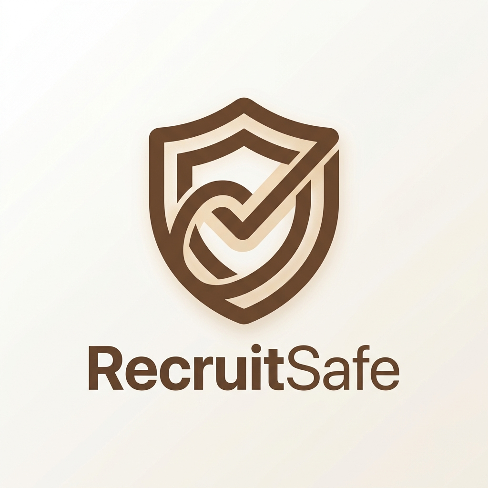
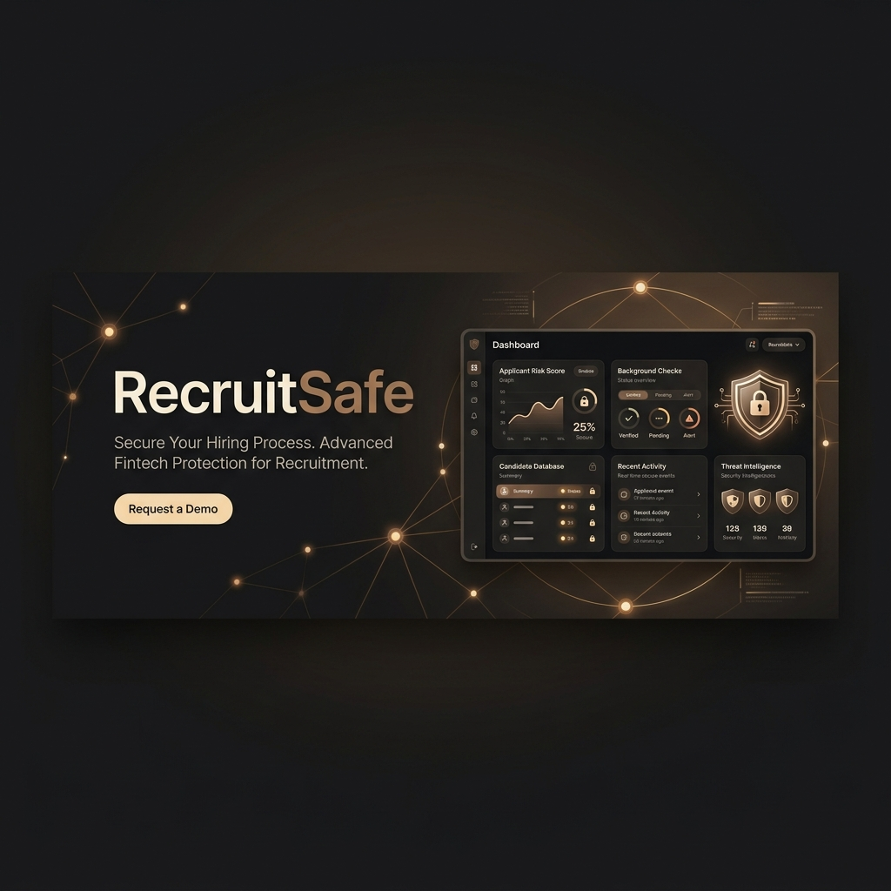
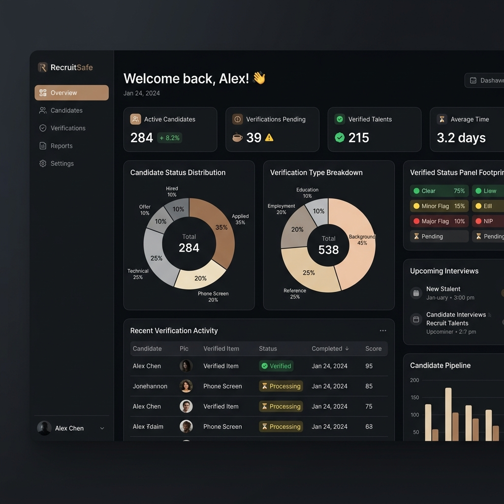
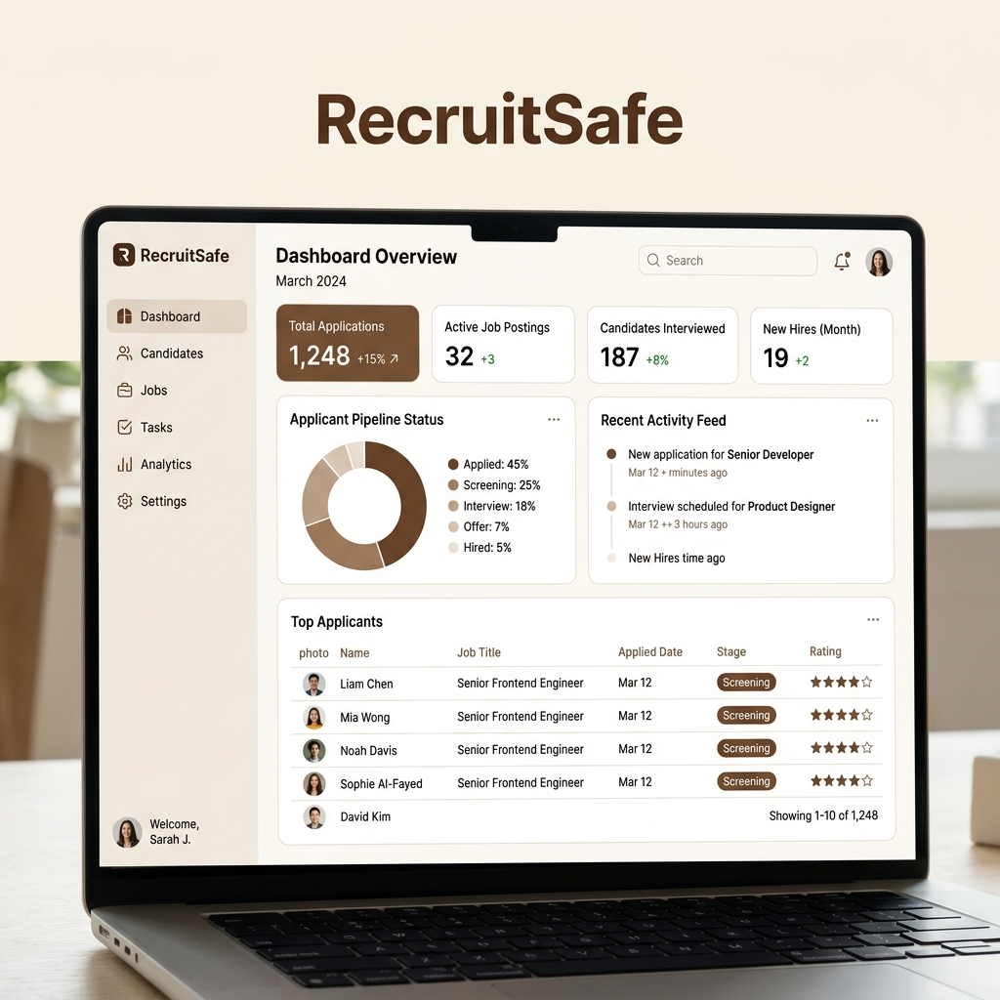
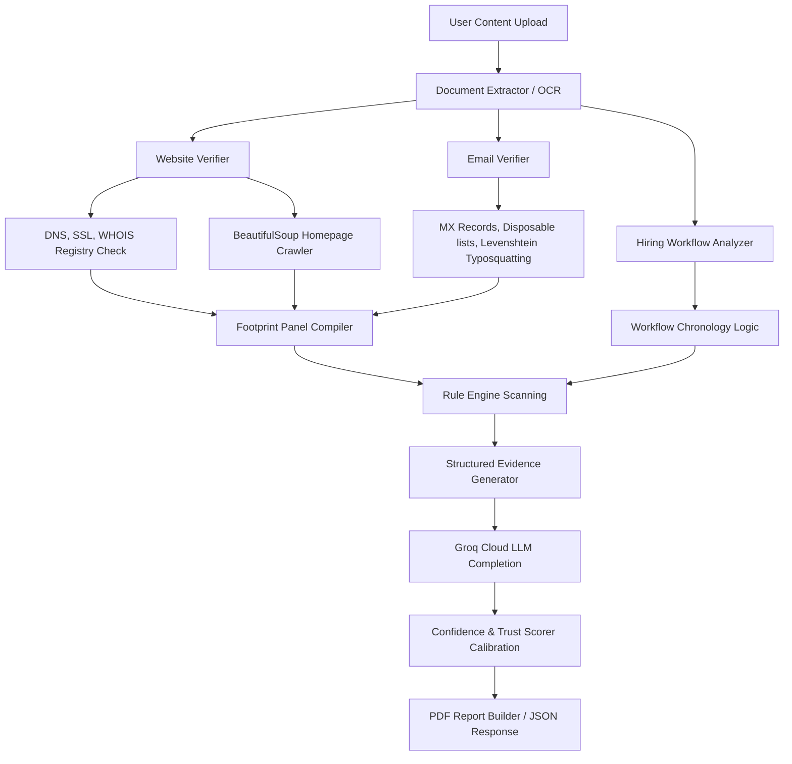

<p align="center">
  
</p>

<h1 align="center">RecruitSafe</h1>

<p align="center">
  <strong>AI-Powered Job & Internship Scam Detection Platform</strong><br />
  Verify • Analyze • Explain • Protect
</p>

<p align="center">
  <a href="#-project-overview">Overview</a> •
  <a href="#-features">Features</a> •
  <a href="#-system-architecture">Architecture</a> •
  <a href="#-explainability-engine">Explainability</a> •
  <a href="#-tech-stack">Tech Stack</a> •
  <a href="#-installation">Installation</a>
</p>

<p align="center">
  
  
  
  
  
  
  
  
</p>

<p align="center">
  
</p>

---

## 🔍 Project Overview

In the modern digital job market, recruitment fraud has reached an all-time high. Bad actors deploy highly sophisticated social engineering tactics—such as fake job descriptions, spoofed corporate email domains, illegitimate clone websites, and high-urgency training fee requests—to harvest sensitive credentials, steal identities (PAN/Aadhaar/Passports), and execute financial scams. 

Traditional anti-phishing filters and email gateways are insufficient because they scan for generic spam headers, completely missing the hiring-context anomalies. **RecruitSafe** is a next-generation cybersecurity audit platform that analyzes job advertisements, recruiter domains, and communications. It uses a **deterministic verification engine** coupled with **Groq-powered Llama semantic intelligence** to provide explainable safety audits for job seekers, freshers, and professionals.

---

## ⚠️ The Problem

Candidates face a diverse range of hiring threats:
* **Advance-Fee Fraud**: Recruiters request security deposits, mandatory onboarding certificates, or registration fees with promises of reimbursement.
* **Identity Harvesting**: Scammers request Aadhaar cards, PAN numbers, and bank details upfront before any screening.
* **Domain Spoofing / Typosquatting**: Attackers register domains resembling legitimate brands (e.g., `google-careers-hr.com` instead of `google.com`).
* **WhatsApp-Only Recruiters**: Recruitment processes conducted entirely over private, unverified chat rooms.
* **Ghost Sites**: Fake corporate platforms missing valid SSL certificates, Privacy Policies, or proper DNS records.

---

## 🛡️ Our Solution

RecruitSafe provides a dual-layer cybersecurity assessment:
1. **Deterministic Verification Layer**: Validates structural footprints (DNS records, MX handlers, SSL handshakes, WHOIS domain ages, page crawled metadata, terms, and policies) with 100% mathematical certainty.
2. **AI Semantic Reasoning Layer**: Groq-powered LLMs analyze the psychological tone, salary feasibility, hiring workflows, and coordination discrepancies.
3. **Consensus Score Calibration**: Synthesizes findings into standalone **Trust Scores**, **Confidence Scores**, and **Verification Status** reports with complete breakdown lists and actionable advice.

---

## ✨ Features

* 📝 **Job Description Parser**: Paste raw text or upload screenshots/PDFs. Handles automatic OCR text extraction.
* 📧 **Domain MX & SPF Inspector**: Detects public providers, disposable email domains, and typosquatting distance similarity.
* 🕸️ **Homepage Metadata Crawler**: Scans sites using `BeautifulSoup` to find Privacy Policies, Careers Portals, Contact details, and LinkedIn corporate pages.
* 🔗 **Hiring Workflow Chronology**: Maps sequences (Application → Screening → Interview → Offer → Onboard) and flags direct-joining or pay-for-training risks.
* 📊 **Calibrated Trust Metrics**: Dynamically maps risk margins (95–100 for Verified, 60–79 for Review, 0–39 for High Risk).
* 📄 **Actionable PDF Reports**: Outputs high-quality, professional ReportLab PDFs detailing positive, negative, and unknown gaps.
* 🎨 **Premium UI/UX**: Notion-style layout built in dark/light themes using custom Coffee Brown tokens, framer-motion cards, and interactive distribution charts.

---

## 📸 Preview Screens

| Dark Theme Dashboard | Light Theme Dashboard |
| --- | --- |
|  |  |

---

## 🏗️ System Architecture

```
                    ┌────────────────────────┐
                    │     React Frontend     │
                    │   (Vite + Tailwind)    │
                    └───────────┬────────────┘
                                │ HTTP API / JWT
                                ▼
                    ┌────────────────────────┐
                    │    FastAPI Backend     │
                    │   (Async REST API)     │
                    └───────────┬────────────┘
                                │
        ┌───────────────────────┴───────────────────────┐
        ▼                                               ▼
┌────────────────────────┐                    ┌────────────────────────┐
│  Verification Engine   │                    │     AI Reasoning       │
│  (DNS, WHOIS, Crawl)   │                    │   (Groq Llama-3.3)     │
└───────────┬────────────┘                    └───────────┬────────────┘
            │                                             │
            └───────────┬─────────────────────────────────┘
                        ▼
            ┌────────────────────────┐
            │   Pipeline Scorer      │
            │   (Trust & Confidence) │
            └───────────┬────────────┘
                        ▼
            ┌────────────────────────┐
            │    MongoDB / Beanie    │
            │   (Caches & Analyses)  │
            └────────────────────────┘
```

---

## ⚡ AI Intelligence Pipeline



---

## 🤖 AI Engine vs. 🛡️ Verification Engine

RecruitSafe maintains a strict boundary between deterministic parameters and AI semantic reasoning:

| Layer | Responsibility | Engine Type | Operations |
| --- | --- | --- | --- |
| **Verification Engine** | Technical checks | Deterministic (Python) | DNS queries, SSL connections, WHOIS age parsing, MX validation, link crawling |
| **AI Engine** | Contextual reasoning | LLM (Groq Llama-3) | Semantic tone, salary feasibility checks, workflow explanation, consensus logs |

---

## ⚙️ Caching Architecture

* **WHOIS & SSL Metadata**: Cached for **7 days** in MongoDB to avoid external registry rate-limiting.
* **AI Reasoning Completion**: Cached for **24 hours** using an MD5 hash of normalized text inputs, guaranteeing instant retrieval for identical postings.

---

## 📦 Project Structure

```
RecruitSafe/
├── backend/
│   ├── app/
│   │   ├── models/           # Beanie MongoDB documents (Analysis, Cache, Notification)
│   │   ├── schemas/          # Pydantic schemas (AnalysisResponse, Auth)
│   │   ├── services/
│   │   │   ├── ai/           # Groq providers, prompts, and parsers
│   │   │   ├── email_verifier.py
│   │   │   ├── website_verifier.py
│   │   │   ├── hiring_workflow_analyzer.py
│   │   │   ├── company_verifier.py
│   │   │   ├── pipeline_orchestrator.py
│   │   │   └── report_generator.py
│   │   └── main.py           # FastAPI entrypoint
│   └── tests/                # Pytest suites
└── frontend/
    ├── src/
    │   ├── components/       # Common layouts, sidebars, headers
    │   ├── context/          # Auth & Theme (Light/Dark) contexts
    │   └── pages/            # Dashboard, New Analysis, Report details
    └── index.html
```

---

## 🚀 Installation & Setup

### 1. Clone the Repository
```bash
git clone https://github.com/your-username/RecruitSafe.git
cd RecruitSafe
```

### 2. Backend Configuration
Create a virtual environment, install dependencies, and define the environment:
```bash
cd backend
python -m venv venv
venv\Scripts\activate      # On Windows
source venv/bin/activate   # On Linux/macOS
pip install -r requirements.txt
```

Create a `.env` file in the `backend/` directory:
```env
MONGODB_URI=mongodb+srv://<username>:<password>@cluster.mongodb.net/recruitsafe
JWT_SECRET=your_super_secure_jwt_secret_key
GROQ_API_KEY=gsk_your_groq_api_key_credentials
GROQ_MODEL=llama-3.3-70b-versatile
AI_PROVIDER=groq
```

Run the backend development server:
```bash
python -m uvicorn app.main:app --host 127.0.0.1 --port 8000 --reload
```

### 3. Frontend Configuration
Install dependencies and run the client:
```bash
cd ../frontend
npm install
```

Create a `.env` file in the `frontend/` directory:
```env
VITE_API_URL=http://localhost:8000
```

Start the Vite dev server:
```bash
npm run dev
```

---

## 🧪 Testing

We use `pytest` for all unit and integration verifications:
```bash
cd backend
python -m pytest tests/unit/test_v2_2_upgrades.py
```
To run the full suite:
```bash
python -m pytest
```

---

## 🔒 Security & Performance

* **JWT Authenticated Headers**: Secure page access and private histories.
* **Password Hashing**: `bcrypt` hashing on all user accounts.
* **Automatic Upload Cleanup**: OCR files are deleted immediately after text extraction.
* **FastAPI Connection Pool**: Connection pooling for MongoDB Atlas transactions.

---

## ⚖️ Disclaimer

RecruitSafe acts as an algorithmic and AI-based audit assistant to identify recruitment discrepancies. It does not issue legal contracts, certifications, or formal statements of legitimacy. Users should verify hiring coordinators independently before sharing credentials or executing bank transactions.