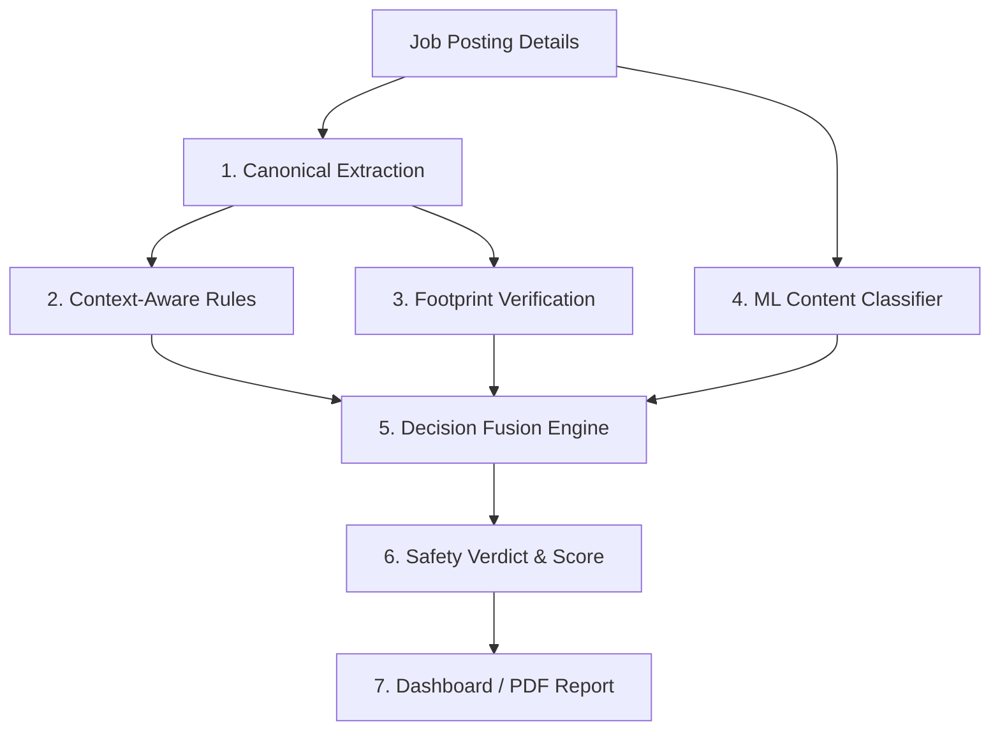
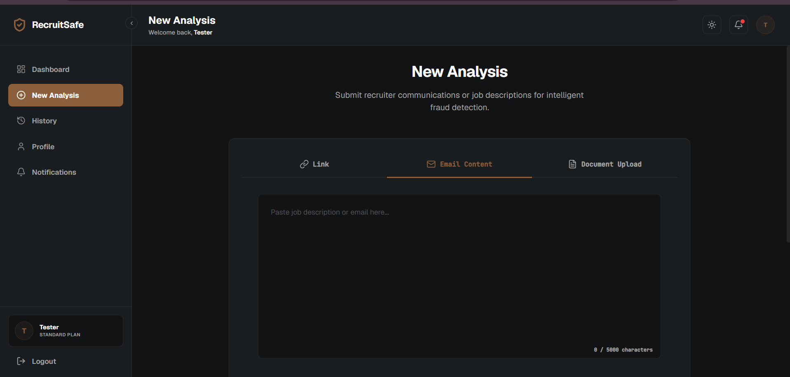
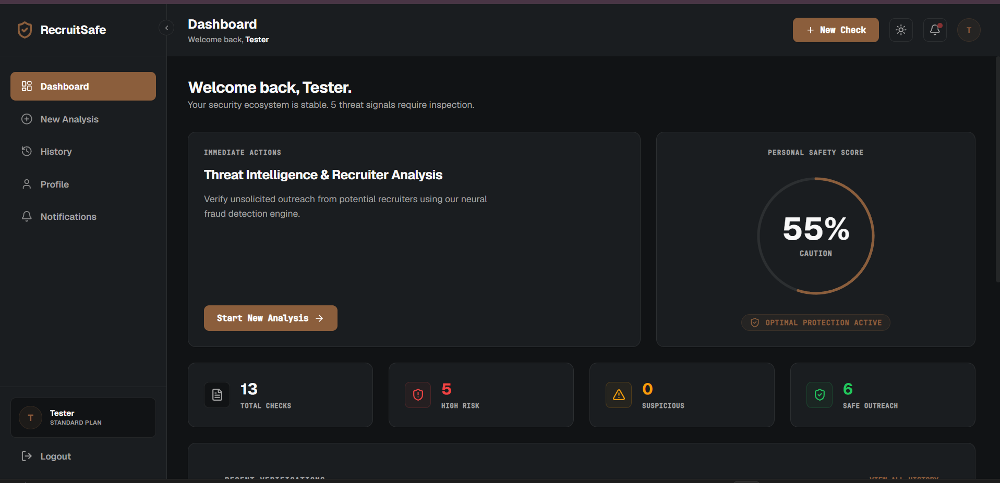
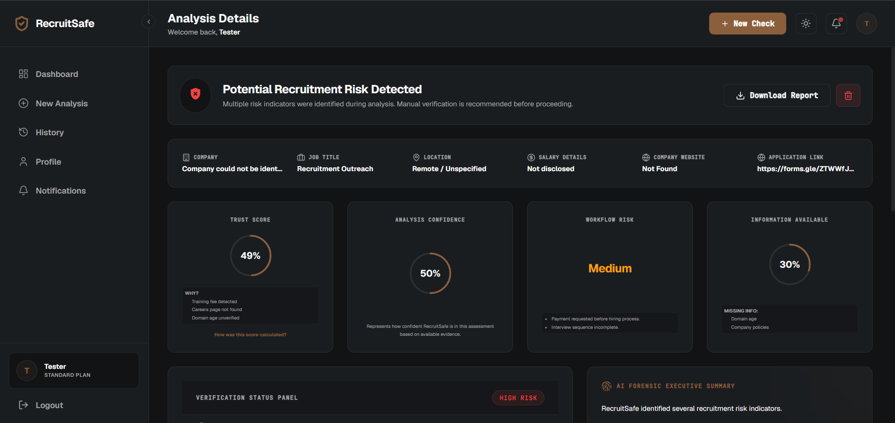
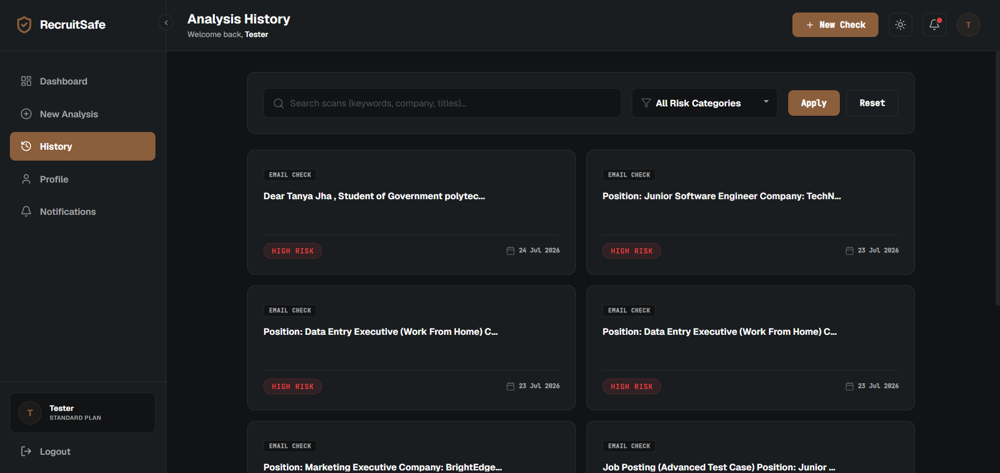

# RecruitSafe — AI-Powered Job Scam Detection Platform

[](https://www.python.org/)
[](https://fastapi.tiangolo.com/)
[](https://react.dev/)
[](https://www.mongodb.com/)
[](https://spacy.io/)
[](https://xgboost.readthedocs.io/)
[](LICENSE)

RecruitSafe is an advanced, multi-layered job posting verification and scam detection platform. By combining regular expression rule matching, deep metadata extraction, external footprint checks, natural language processing context models, and machine learning classifiers, RecruitSafe helps job seekers identify deceptive job offers and fraudulent recruiters.

---

## 📖 Table of Contents

1. [Intended Audience](#-intended-audience)
2. [Project Overview](#-project-overview)
3. [Key Features](#-key-features)
4. [High-Level Workflow & Architecture](#-high-level-workflow--architecture)
5. [Technology Stack](#-technology-stack)
6. [Quick Start](#-quick-start)
7. [Repository Structure](#-repository-structure)
8. [📚 Documentation Navigation](#-documentation-navigation)

---

## 🎯 Intended Audience

This document is designed for all project visitors, including **recruiters**, **first-time GitHub visitors**, **open-source contributors**, and **software developers** seeking a high-level understanding of the platform.

---

## 🔍 Project Overview

Job seekers are increasingly targeted by sophisticated employment scams (e.g. upfront training fees, identity theft phishing, or fake companies). RecruitSafe provides a commercial-grade cybersecurity solution that parses job descriptions, audits online registry records, scores communication intents, and runs predictive machine learning models to assign a clear safety verdict.

> [!NOTE]
> RecruitSafe is designed to estimate recruitment risk using evidence-based scores. It is a risk-assessment tool, not a legal certifier.

---

## ✨ Key Features

* **Canonical Extraction**: Identifies and isolates 31 distinct metadata parameters (e.g., salary, recruiter email, and company details) from job postings.
* **Context-Aware Rule Engine**: Employs spaCy token dependency parsing to differentiate between benign and deceptive intents (e.g., company reimbursement vs. mandatory training fee scams).
* **Live Footprint Verification**: Performs automated audits of domain registry status, DNS reachability, SSL certificate validity, and WHOIS domain age.
* **Machine Learning Classifier**: Utilizes an XGBoost model trained on text vectors to predict job listing legitimacy.
* **Hybrid Decision Fusion**: Fuses rule deductions, verification scores, and ML predictions into a single Trust Score.
* **Professional PDF Audits**: Compiles comprehensive job verification reports for immediate download.

---

## 📐 High-Level Workflow & Architecture

RecruitSafe processes job descriptions through a modular pipeline. Below is the high-level data flow:



### 🖼️ Platform Previews

| Scan Job Description | Dashboard View | Analysis Details | History Log |
| :---: | :---: | :---: | :---: |
|  |  |  |  |

---

## 💻 Technology Stack

* **Frontend**: React, Vite, Vanilla CSS.
* **Backend**: FastAPI (Python).
* **Database**: MongoDB (Beanie ODM).
* **NLP**: spaCy (`en_core_web_sm` pipeline).
* **Machine Learning**: XGBoost, Scikit-learn (TF-IDF vectorizer).
* **Reports**: ReportLab PDF generator.

---

## 🚀 Quick Start

### 1. Backend Setup
Navigate to the `backend/` directory, create a virtual environment, and install dependencies:
```bash
cd backend
python -m venv venv
venv\Scripts\activate  # On macOS/Linux: source venv/bin/activate
pip install -r requirements.txt
python -m spacy download en_core_web_sm
```

Set up your `.env` configuration:
```env
MONGODB_URL=mongodb://localhost:27017/recruitsafe
SECRET_KEY=your_jwt_secret_key_here
GROQ_API_KEY=your_groq_api_key_here
```

Start the FastAPI application:
```bash
python -m uvicorn app.main:app --host 127.0.0.1 --port 8000 --reload
```

### 2. Frontend Setup
Navigate to the `frontend/` directory, install packages, and start the development server:
```bash
cd ../frontend
npm install
npm run dev
```

The application will be accessible at:
* **Frontend**: `http://localhost:5173/`
* **API Documentation (Swagger UI)**: `http://127.0.0.1:8000/docs`

---

## 📂 Repository Structure

```text
RecruitSafe/
├── backend/            # FastAPI source code, ML model assets, configuration files
├── docs/               # In-depth architectural, setup, and user guides
├── frontend/           # React dashboard UI components
├── LICENSE             # Project MIT License
└── README.md           # Root landing page (this document)
```

---

## 📚 Documentation Navigation

Explore specific guides for deeper technical details and workflows:

| Document | Target Audience | Key Contents |
|----------|-----------------|--------------|
| [Setup Guide](docs/Setup.md) | Developers, DevOps | Step-by-step local install, DB setup, environment variables. |
| [System Architecture](docs/Architecture.md) | Technical Architects | Layered model, pipeline orchestrator, data flow. |
| [API Documentation](docs/API.md) | Frontend Engineers | REST endpoints, JWT authentication, JSON payloads. |
| [Developer Guide](docs/DeveloperGuide.md) | Software Engineers | Coding standards, adding rules, extending verification. |
| [User Guide](docs/UserGuide.md) | Recruiters, Job Seekers | Scanning jobs, interpreting scores, downloading PDFs. |
| [Database Schema](docs/Database.md) | Backend Devs, DBAs | Collection definitions, compound indexing, Beanie ODM. |
| [Configuration Reference](docs/Configuration.md) | DevOps, System Operators | Config JSON schemas for scores, weights, and rules. |
| [Security Architecture](docs/Security.md) | Security Auditors | JWT validation, password hashing, input sanitization. |
| [Testing Guide](docs/Testing.md) | QA Engineers, Developers | pytest tests, pipeline validation, regression boundary testing. |
| [Deployment Guide](docs/Deployment.md) | DevOps, SREs | Docker, environment configurations, reverse proxies. |
| [Future Roadmap](docs/Roadmap.md) | Product Managers, Visitors | Completed features, next releases, planned extensions. |
| [Contributing Guide](CONTRIBUTING.md) | Contributors | Pull request process, issue formatting, coding standards. |
| [Changelog](CHANGELOG.md) | All Users | Semantic version release history (V1 to V4). |