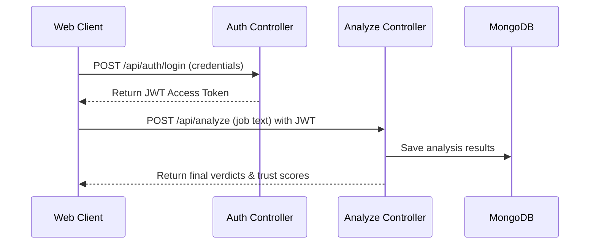

# RecruitSafe — REST API Endpoint Specifications

---

## 📖 Table of Contents

1. [Intended Audience](#-intended-audience)
2. [Global Headers & Authentication](#-global-headers--authentication)
3. [API Call Sequence Flow](#-api-call-sequence-flow)
4. [Authentication Endpoints](#-authentication-endpoints)
5. [Analysis Endpoints](#-analysis-endpoints)
6. [Dashboard & History Endpoints](#-dashboard--history-endpoints)
7. [Report Endpoints](#-report-endpoints)
8. [System & Model Health Endpoints](#-system--model-health-endpoints)
9. [Error Mapping & HTTP Status Codes](#-error-mapping--http-status-codes)
10. [📚 Documentation Navigation](#-documentation-navigation)

---

## 🎯 Intended Audience

This document is designed for **frontend developers**, **system integrators**, and **QA engineers** who interact with or develop clients for the RecruitSafe REST API.

---

## 🔐 Global Headers & Authentication

All API endpoints except authentication and health checks require a valid JSON Web Token (JWT) passed in the HTTP Authorization header:

```http
Authorization: Bearer <your_jwt_access_token_here>
```

---

## 📐 API Call Sequence Flow

Below is the standard client-server interaction sequence for a job scanning session:



---

## 🚪 Authentication Endpoints

### 1. Register User
* **HTTP Method**: `POST`
* **Route**: `/api/auth/register`
* **Authentication**: None
* **Request Payload**:
  ```json
  {
    "email": "candidate@example.com",
    "password": "secure_password_123"
  }
  ```
* **Success Response (201 Created)**:
  ```json
  {
    "message": "User registered successfully",
    "user_id": "6a62583831250d7c5cbc5af5"
  }
  ```
* **Common Errors**:
  - `400 Bad Request`: Email address is already registered.

### 2. User Login
* **HTTP Method**: `POST`
* **Route**: `/api/auth/login`
* **Authentication**: None
* **Request Payload**:
  ```json
  {
    "email": "candidate@example.com",
    "password": "secure_password_123"
  }
  ```
* **Success Response (200 OK)**:
  ```json
  {
    "access_token": "eyJhbGciOiJIUzI1NiIsInR5cCI6IkpXVCJ9...",
    "token_type": "bearer"
  }
  ```
* **Common Errors**:
  - `401 Unauthorized`: Invalid email credentials or password.

---

## 🔍 Analysis Endpoints

### 1. Submit Job for Analysis
* **HTTP Method**: `POST`
* **Route**: `/api/analyze`
* **Authentication**: JWT Token (Bearer)
* **Request Payload**:
  ```json
  {
    "text": "Seeking remote entry-level software engineer. Training fee of $40 is required before onboarding laptops are sent..."
  }
  ```
* **Success Response (200 OK)**:
  ```json
  {
    "id": "6a62607f0ad8e7a359361332",
    "risk_category": "High Risk",
    "trust_score": 45,
    "confidence_score": 90
  }
  ```

### 2. Retrieve Specific Analysis Details
* **HTTP Method**: `GET`
* **Route**: `/api/analyze/{id}`
* **Authentication**: JWT Token (Bearer)
* **Success Response (200 OK)**:
  ```json
  {
    "id": "6a62607f0ad8e7a359361332",
    "risk_category": "High Risk",
    "trust_score": 45,
    "confidence_score": 90,
    "original_content": "Seeking remote entry-level software engineer...",
    "processed_text": "Seeking remote entry-level software engineer...",
    "verification_status": {
      "Website": "Not Found",
      "SSL": "Invalid",
      "Corporate Email": "Invalid",
      "Careers Page": "Not Found",
      "Domain Age": "Unknown"
    },
    "evidence": [
      {
        "id": "training_fee",
        "factor_name": "Upfront training fee requested",
        "score": -40,
        "severity": "HIGH",
        "context": {
          "matched_text": "Training fee of $40 is required",
          "sentence": "Training fee of $40 is required before onboarding.",
          "previous_sentence": "Seeking remote entry-level software engineer.",
          "next_sentence": "",
          "window_before": "Seeking remote entry-level software engineer.",
          "window_after": "",
          "tokens": [],
          "dependencies": [],
          "entities": [],
          "noun_chunks": []
        }
      }
    ],
    "recommendations": [
      "Refrain from paying any upfront onboarding fees.",
      "Verify the recruiter identity using corporate directories."
    ]
  }
  ```
* **Common Errors**:
  - `404 Not Found`: The specified Analysis ID does not exist.

---

## 📊 Dashboard & History Endpoints

### 1. Get Analysis History List
* **HTTP Method**: `GET`
* **Route**: `/api/history`
* **Authentication**: JWT Token (Bearer)
* **Query Parameters**:
  - `page`: Page index (default: `1`).
  - `per_page`: Records per page (default: `8`).
  - `q`: Text search query (optional).
  - `risk_category`: Filter by risk tier (optional).
* **Success Response (200 OK)**:
  ```json
  {
    "items": [
      {
        "id": "6a62607f0ad8e7a359361332",
        "job_title": "Entry-Level Developer",
        "company_name": "Possible Company: Unspecified",
        "risk_category": "High Risk",
        "trust_score": 45,
        "created_at": "2026-07-24T22:58:35Z"
      }
    ],
    "total": 1,
    "page": 1,
    "per_page": 8,
    "pages": 1
  }
  ```

### 2. Get Dashboard Aggregated Statistics
* **HTTP Method**: `GET`
* **Route**: `/api/dashboard`
* **Authentication**: JWT Token (Bearer)
* **Success Response (200 OK)**:
  ```json
  {
    "total_analyses": 24,
    "risk_breakdown": {
      "Safe": 12,
      "Needs Review": 8,
      "High Risk": 4
    },
    "recent_scam_signals": [
      "Upfront payment request detected",
      "Unverified email domain"
    ]
  }
  ```

---

## 📄 Report Endpoints

### Download Analysis PDF Report
* **HTTP Method**: `GET`
* **Route**: `/api/report/{id}`
* **Authentication**: JWT Token (Bearer)
* **Success Response (200 OK)**:
  - Header: `Content-Type: application/pdf`
  - Body: Binary stream representing the compiled PDF audit report.
* **Common Errors**:
  - `404 Not Found`: Report for this ID not generated or not found.

---

## 🩺 System & Model Health Endpoints

### ML Model Pipeline Status
* **HTTP Method**: `GET`
* **Route**: `/api/ml/health`
* **Authentication**: None
* **Success Response (200 OK)**:
  ```json
  {
    "loaded": true,
    "model_name": "recruitsafe_xgb",
    "model_version": "1.0.0",
    "vectorizer_loaded": true,
    "model_loaded": true
  }
  ```

---

## ❌ Error Mapping & HTTP Status Codes

RecruitSafe uses standard HTTP status codes to communicate errors:

| Code | Status Text | Rationale / Resolution |
|------|-------------|------------------------|
| **400** | `Bad Request` | Payload syntax error, missing fields, or validation schema failures. |
| **401** | `Unauthorized` | Missing, expired, or invalid authorization credentials. |
| **403** | `Forbidden` | Restricted resource access (e.g. user trying to access admin functions). |
| **404** | `Not Found` | Resource ID, user profile, or endpoint route not found. |
| **500** | `Internal Server Error` | Database connection failures, ML inference errors, or pipeline orchestrator crashes. |

---

## 📚 Documentation Navigation

| Document | Target Audience | Key Contents |
|----------|-----------------|--------------|
| [Root README](../README.md) | Everyone | Project pitch, technology stack, previews, and quick start. |
| [Setup Guide](Setup.md) | Developers, DevOps | Local configuration, dependencies, and environment files. |
| [System Architecture](Architecture.md) | Technical Architects | Layered model, pipeline orchestrator, data flow. |
| [Developer Guide](DeveloperGuide.md) | Software Engineers | Pipeline extensions, adding custom rules, and testing guidelines. |
| [User Guide](UserGuide.md) | Job Seekers, Recruiters | Interpreting threat indicators and downloading PDF reports. |
| [Database Schema](Database.md) | DBAs, Backend Devs | Collection definitions, indexes, and Beanie ODM setup. |
| [Configuration Reference](Configuration.md) | DevOps, System Operators | Behavior parameter configurations and score maps. |
| [Security Architecture](Security.md) | Security Auditors | Threat models, JWT encryption, and sanitization parameters. |
| [Testing Guide](Testing.md) | QA Engineers, Developers | pytest tests, validation boundary targets, and unit tests. |
| [Deployment Guide](Deployment.md) | DevOps, SREs | Production setups, Docker orchestration, and reverse proxies. |
| [Future Roadmap](Roadmap.md) | Product Managers, Visitors | Planned release timeline and architectural expansions. |
