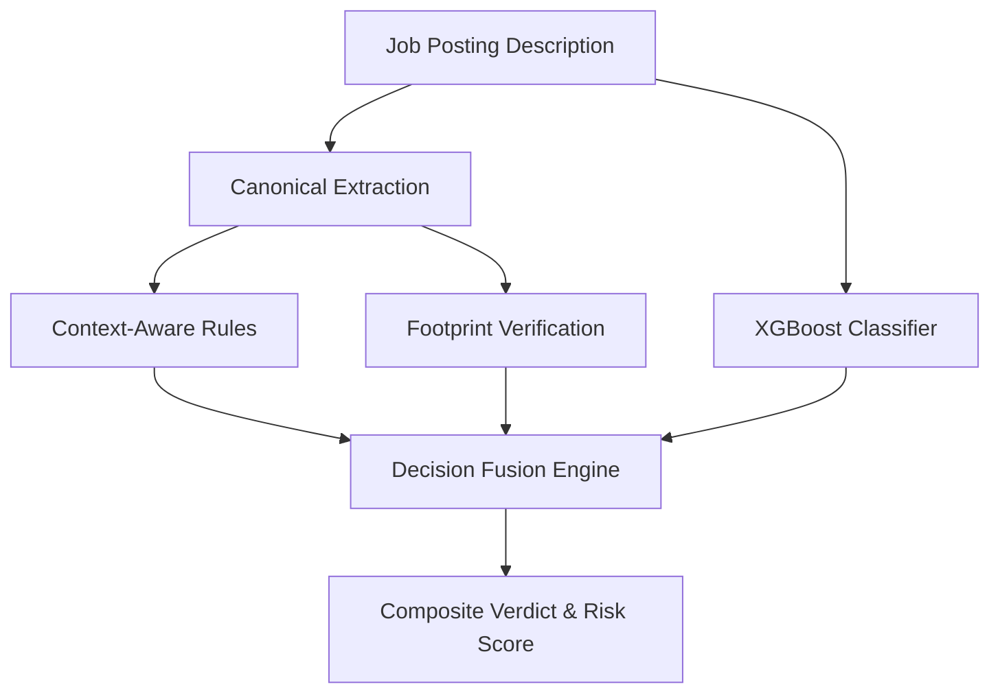
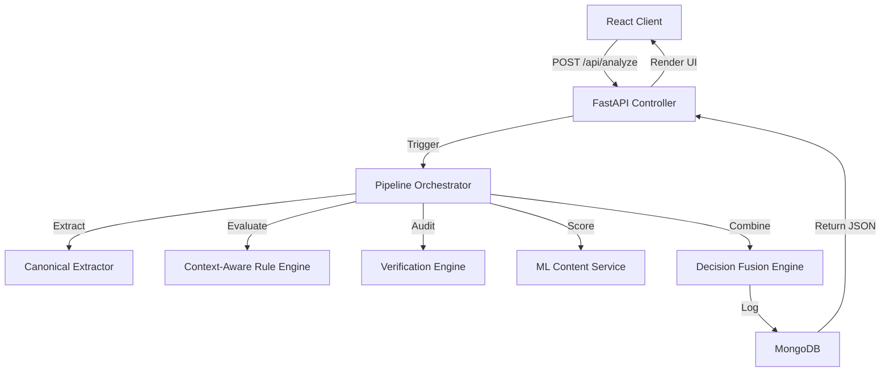
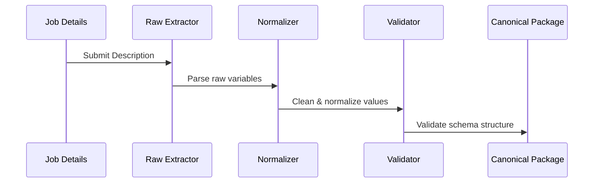
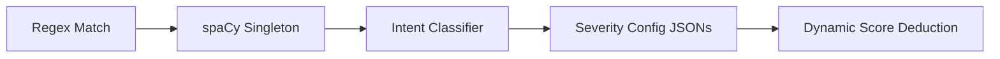
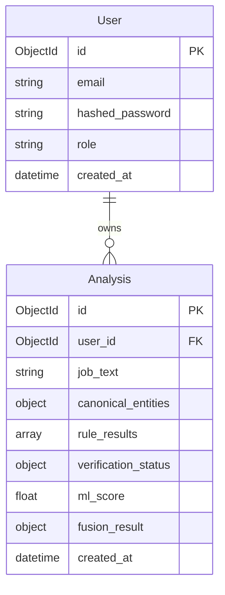
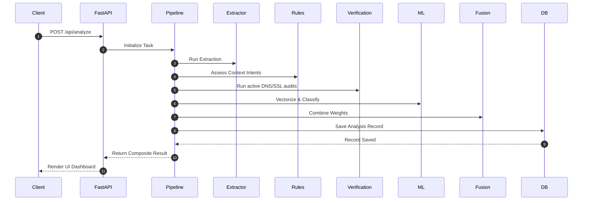
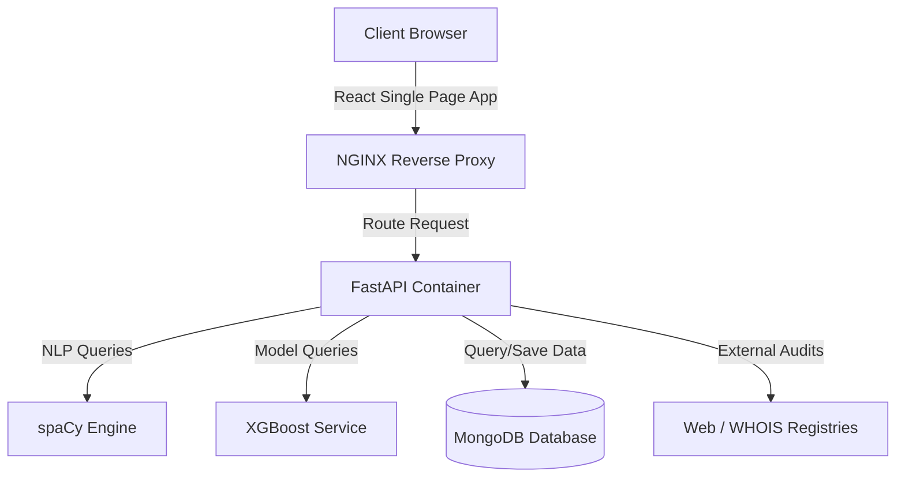
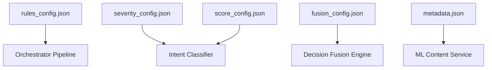

# RecruitSafe — System Architecture Documentation

---

## 📖 Table of Contents

1. [Intended Audience](#-intended-audience)
2. [High-Level Architecture](#-high-level-architecture)
3. [Layered Architecture](#-layered-architecture)
4. [Component Orchestration & Lifecycle](#-component-orchestration--lifecycle)
5. [Pipeline Orchestrator](#-pipeline-orchestrator)
6. [Canonical Extraction Pipeline](#-canonical-extraction-pipeline)
7. [Context-Aware Rule Engine](#-context-aware-rule-engine)
8. [Verification Engine](#-verification-engine)
9. [Machine Learning Pipeline](#-machine-learning-pipeline)
10. [Decision Fusion Engine](#-decision-fusion-engine)
11. [Database Architecture](#-database-architecture)
12. [API Request Lifecycle](#-api-request-lifecycle)
13. [Deployment Topology](#-deployment-topology)
14. [Configuration Architecture](#-configuration-architecture)
15. [Fault Tolerance & Resiliency](#-fault-tolerance--resiliency)
16. [Explainability Features](#-explainability-features)
17. [Future Architecture Extensions](#-future-architecture-extensions)
18. [📚 Documentation Navigation](#-documentation-navigation)

---

## 🎯 Intended Audience

This document is designed for **technical architects**, **developers**, and **contributors** wanting to understand the RecruitSafe internal pipelines, component boundaries, and security architectures.

---

## 🏛️ High-Level Architecture

RecruitSafe implements a **Hybrid Decision Intelligence Model** that fuses deterministic rules, active server footprint verifications, and machine learning models to assess job recruitment risks. 

---

## 🥞 Layered Architecture

RecruitSafe isolates concerns using a standard six-layer architectural model:

| Layer | Component | Core Technologies | Primary Responsibility |
|-------|-----------|-------------------|------------------------|
| **Presentation** | React SPA | React, Vite, CSS | Renders scanning screens, trust scores, and verifications. |
| **API** | REST Endpoints | FastAPI, Uvicorn | Routing, JWT token validations, CORS, rate limits. |
| **Pipeline** | Orchestrator | Python Asyncio | Drives extraction, rule matching, verifications, and ML scans. |
| **AI** | Engines & Models | spaCy, XGBoost, TF-IDF | Text vectors, syntax patterns, intent classification. |
| **Persistence** | MongoDB | MongoDB, Beanie ODM | Stores analysis summaries, audits, and user documents. |
| **Infrastructure** | Environment / PDF | OS, ReportLab | Drives runtime configurations and PDF generation. |

---

## ⚙️ Component Orchestration & Lifecycle

The platform components orchestrate evaluations sequentially through the backend processing layers:

---

## 🚂 Pipeline Orchestrator

The `PipelineOrchestrator` (`backend/app/services/pipeline_orchestrator.py`) acts as the state manager and runner for the verification pipeline:
* **Execution Order**: Starts with text extraction, continues with parallel rule matching and active web verification lookups, runs the ML classifier, and finishes at the Decision Fusion Engine.
* **Failure Handling**: Handles individual task failures gracefully. If web verification times out or DNS lookups fail, default unverified states are passed to the Fusion Engine rather than crashing the pipeline.
* **Persistence**: Automatically logs the complete run, metrics, and intermediate indicators to MongoDB under a single transaction.

---

## 📥 Canonical Extraction Pipeline

The extraction pipeline decouples raw metadata parsing from formatting and validation:
1. **Raw Extractor**: Parses names, emails, salaries, locations, and website strings.
2. **Normalizer**: Cleans fields (e.g. converting domains to lowercase, standardizing phone structures).
3. **Validator**: Asserts formatting schemas (e.g. email patterns).
4. **Output**: Produces a strongly typed canonical entity package.

---

## 🧠 Context-Aware Rule Engine

This engine upgrades simple keyword matching to linguistic context analysis:
* **spaCy Pipeline**: A shared singleton `NLPService` parses tokens, parts of speech (POS), and syntax trees.
* **Intent Classifier**: Semantically analyzes modifiers and dependencies (e.g., classifying a payment phrase as `MANDATORY_PAYMENT` or `COMPANY_REIMBURSEMENT`).
* **Dynamic Severity**: Intent maps are evaluated against configurations (`severity_config.json` and `score_config.json`) to assign dynamic point deductions.

---

## 🌐 Verification Engine

Verifies external domain presence and infrastructure health:
* **Company Website**: Validates DNS routing and redirects.
* **SSL & HTTPS**: Checks certificate integrity and validity.
* **WHOIS**: Queries registration status to calculate domain age.
* **Corporate Email**: Assesses if contact emails match registered corporate domains or use public/disposable hosts.
* **Careers Page & Policies**: Crawls and validates links for legal verification documents.

---

## 🤖 Machine Learning Pipeline

Analyzes the structural and linguistic similarity of listing content to historical scam datasets:
* **TF-IDF Vectorizer**: Vectorizes job descriptions. Loaded lazily to optimize start times.
* **XGBoost Classifier**: Predicts listing scam probability.
* **Preloading & Thread Safety**: Uses a `threading.Lock()` during preloading to ensure concurrent requests share the same loaded model safely.
* **Model Versioning**: Tracks model version, name, and metrics dynamically via an accompanying `metadata.json`.

---

## 🎛️ Decision Fusion Engine

Calculates the final composite safety verdict by weighting inputs dynamically:
$$Score_{composite} = (W_{rules} \times Score_{rules}) + (W_{verif} \times Score_{verif}) + (W_{ml} \times Score_{ml})$$

* **Configuration**: Fusing weights and score thresholds are loaded at runtime from `fusion_config.json`.
* **Verdict Resolution**: Maps scores to safety tiers (`SAFE`, `SUSPICIOUS`, `HIGH_RISK`, `SCAM`).
* **Confidence Rating**: Computes analysis completeness based on available inputs.

---

## 🗄️ Database Architecture

RecruitSafe uses MongoDB with Beanie ODM. The collections schema is as follows:

* **Indexes**: Unique index on `User.email` and search indexes on `Analysis.created_at` and `Analysis.user_id`.

---

## 🔄 API Request Lifecycle

The flow of an analysis request from client to database:

---

## 🚏 Deployment Topology

The physical runtime topology of RecruitSafe components:

---

## 🛠️ Configuration Architecture

RecruitSafe behavior is driven by decoupled JSON configurations:

---

## 🛡️ Fault Tolerance & Resiliency

To remain reliable in production, RecruitSafe is built with specific fallback mechanisms:
* **ML Service Failure**: If vectorizer or model binaries fail to load, the ML component returns a `0.5` neutral score to the Decision Fusion engine, allowing analysis to continue.
* **Verification Engine Timeouts**: Individual network checks are wrapped in strict asyncio timeouts (default: `5.0` seconds) to prevent frozen requests.
* **Rule Engine Fallback**: In case of NLP tokenizer failures, matching reverts to basic regular expression match spans.

---

## 🔍 Explainability Features

A critical goal of the architecture is transparency:
* **Why List**: Explains specifically which components (rules, verification, or ML classification) contributed to a reduced Trust Score.
* **Evidence Log**: Displays matched phrases, extracted context windows, classified intents, and verification failures directly on the UI dashboard and generated PDF reports.

---

## 🗺️ Future Architecture Extensions

* **Browser Extension**: Planned companion extension to scan LinkedIn, Indeed, and glassdoor job postings directly.
* **Distributed Threat Intelligence Registry**: Shared database of scam templates and fraudulent recruiter contact domains.
* **Multilingual NLP Support**: Adding multilingual tokenization mapping support for European and Asian job boards.

---

## 📚 Documentation Navigation

| Document | Target Audience | Key Contents |
|----------|-----------------|--------------|
| [Root README](../README.md) | Everyone | Project pitch, technology stack, previews, and quick start. |
| [Setup Guide](Setup.md) | Developers, DevOps | Local configuration, dependencies, and environment files. |
| [API Specifications](API.md) | Frontend Engineers | Complete route details, payload schemas, and response maps. |
| [Developer Guide](DeveloperGuide.md) | Software Engineers | Pipeline extensions, adding custom rules, and testing guidelines. |
| [User Guide](UserGuide.md) | Job Seekers, Recruiters | Interpreting threat indicators and downloading PDF reports. |
| [Database Schema](Database.md) | DBAs, Backend Devs | Collection definitions, indexes, and Beanie ODM setup. |
| [Configuration Reference](Configuration.md) | DevOps, System Operators | Behavior parameter configurations and score maps. |
| [Security Architecture](Security.md) | Security Auditors | Threat models, JWT encryption, and sanitization parameters. |
| [Testing Guide](Testing.md) | QA Engineers, Developers | pytest structures, validation boundary targets, and unit tests. |
| [Deployment Guide](Deployment.md) | DevOps, SREs | Production setups, Docker orchestration, and reverse proxies. |
| [Future Roadmap](Roadmap.md) | Product Managers, Visitors | Planned release timeline and architectural expansions. |
