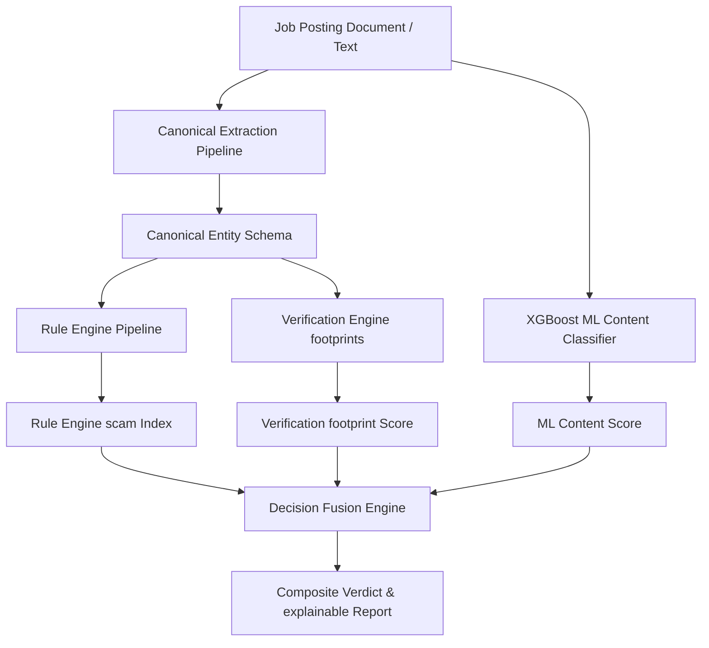
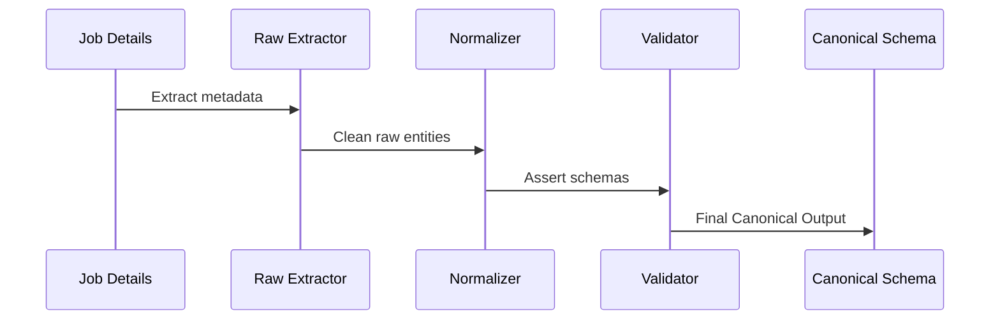

# RecruitSafe - System Architecture Documentation

This document describes the high-level system architecture, component design, pipelines, database mappings, and security implementations of RecruitSafe.

---

## 🏛️ 1. High-Level Architecture Overview

RecruitSafe uses a **Hybrid Decision Intelligence Architecture** that merges deterministic rule evaluations, external footprints checks, and machine learning models to classify and explain job recruitment threats.

---

## ⚙️ 2. Component Design & Pipelines

### A. Canonical Extraction Pipeline
Separates extraction, normalization, and validation:
1. **Raw Extractor**: Processes the job description text and isolates company names, website links, email domains, salary values, and contact details.
2. **Normalizer**: Standardizes values (e.g. mapping domains to lower case, cleaning phone numbers, matching currency formatting).
3. **Validator**: Asserts value formats against schema rules.
4. **Canonical Entity Schema**: Outputs a strongly typed metadata package (mapping 31 supported entities).

### B. Context-Aware Rule Engine
Evaluates 16 keyword-based regular expressions and runs spaCy context evaluations on context-aware rules:
* **spaCy Pipeline**: Single-loaded model analyzing sentence boundaries and POS dependencies.
* **Intent Classifier**: Maps surrounding text into semantic intents (e.g. `MANDATORY_PAYMENT`, `OPTIONAL_TRAINING`, `COMPANY_REIMBURSEMENT`).
* **Severity Mapping**: Maps intents to configurable severity parameters (`severity_config.json`).
* **Score Mapping**: Resolves severity to dynamic points deductions (`score_config.json`).

### C. Verification Engine
* **Website Verifier**: Validates DNS reachable status, resolves HTTPS redirects, verifies SSL certificates, and extracts WHOIS domain age.
* **Company Verifier**: Crawler checks. Marks signals as `✓ Verified`, `⚠ Missing` (inspected but absent), or `? Unknown` (unreachable/lookup failures).

### D. ML Content Service
* **Model**: XGBoost classifier trained on text vectors.
* **Vectorizer**: TF-IDF vectorizer mapping text tokens into float vectors.
* **Metadata**: Accompanying `metadata.json` exposing versioning data. Exposes lazy loading and thread safety protections.

### E. Decision Fusion Engine
Combines the normalized scores using configurable weights:
$$Score_{composite} = (W_{rules} \times Score_{rules}) + (W_{verif} \times Score_{verif}) + (W_{ml} \times Score_{ml})$$
* **Config**: Dynamically loaded from `fusion_config.json`.
* **Verdict Resolver**: Resolves final risk verdict (`SAFE`, `SUSPICIOUS`, `HIGH_RISK`, `SCAM`) and confidence breakdown.

---

## 🗄️ 3. Database Architecture

MongoDB is managed via **Beanie ODM** using the following core schemas:

* **User Document (`User`)**:
  - `email`: Indexed string (indexed unique).
  - `hashed_password`: String.
  - `role`: String (`user`, `admin`).
  - `created_at`: Datetime.

* **Analysis Result Document (`Analysis`)**:
  - `user_id`: Link to User Document.
  - `job_text`: Raw input.
  - `canonical_entities`: Key-value map of 31 entities.
  - `rule_results`: List of triggered evidence entries.
  - `verification_results`: Footprints statuses.
  - `ml_score`: Float.
  - `fusion_result`: Composite score, verdict, and explainability breakdowns.
  - `created_at`: Datetime.

---

## 🔒 4. Security Architecture

1. **Authentication**: JWT-based access tokens with bcrypt password hashing.
2. **Access Control**: Role-based routing (Admin routes restricted).
3. **Data Sanitization**: Bleach-based input sanitization on all text submissions.
4. **Environment Controls**: Env variables clamp secret tokens, cors origin lists, and third-party API keys (Groq).
