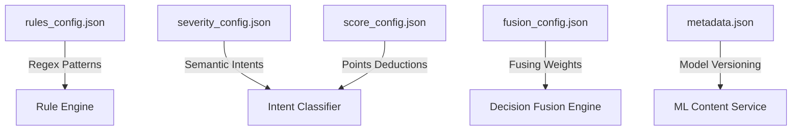

# RecruitSafe — Configuration Reference Guide

---

## 📖 Table of Contents

1. [Intended Audience](#-intended-audience)
2. [Configuration Pipeline Flow](#-configuration-pipeline-flow)
3. [`rules_config.json` Schema](#rules_configjson-schema)
4. [`severity_config.json` Schema](#severity_configjson-schema)
5. [`score_config.json` Schema](#score_configjson-schema)
6. [`fusion_config.json` Schema](#fusion_configjson-schema)
7. [`metadata.json` (ML Model Metadata)](#metadatajson-ml-model-metadata)
8. [Hot-Reloading Behaviors](#-hot-reloading-behaviors)
9. [📚 Documentation Navigation](#-documentation-navigation)

---

## 🎯 Intended Audience

This document is designed for **system operators**, **DevOps engineers**, and **developers** who configure detection thresholds, pattern keywords, weights, and ML versions.

---

## 📐 Configuration Pipeline Flow

Behavior configurations in RecruitSafe are modularized. The diagram below shows how configuration settings feed into different processing stages:



---

## 📄 `rules_config.json` Schema

Governs the keyword pattern databases compiled by the Rule Engine.

* **Path**: `backend/app/config/rules_config.json`

### File Structure Example
```json
[
  {
    "id": "training_fee",
    "name": "Mandatory Training Fees",
    "description": "Triggered when paid training courses are made a prerequisite for employment.",
    "category": "financial_fraud",
    "severity": "HIGH",
    "keywords": [
      "training fee",
      "buy certification",
      "purchase materials"
    ]
  }
]
```

---

## 📄 `severity_config.json` Schema

Maps semantic intents computed by the NLP Intent Classifier into severity rankings.

* **Path**: `backend/app/config/severity_config.json`

### File Structure Example
```json
{
  "MANDATORY_PAYMENT": "HIGH",
  "OPTIONAL_TRAINING": "LOW",
  "COMPANY_REIMBURSEMENT": "NONE",
  "MANDATORY_TRAINING": "HIGH",
  "MANDATORY_COMMUNICATION": "HIGH",
  "OPTIONAL_COMMUNICATION": "NONE",
  "REALISTIC_SALARY": "NONE",
  "UNREALISTIC_SALARY": "HIGH",
  "NO_INTERVIEW": "MEDIUM",
  "URGENT_RECRUITMENT": "LOW",
  "UNKNOWN": "LOW"
}
```

---

## 📄 `score_config.json` Schema

Assigns numerical point deductions to each severity level.

* **Path**: `backend/app/config/score_config.json`

### File Structure Example
```json
{
  "NONE": 0,
  "LOW": 5,
  "MEDIUM": 20,
  "HIGH": 40,
  "CRITICAL": 60
}
```

---

## 📄 `fusion_config.json` Schema

Configures the weights used to calculate the composite Trust Score.

* **Path**: `backend/app/config/fusion_config.json`

### File Structure Example
```json
{
  "rules_weight": 0.40,
  "verification_weight": 0.35,
  "ml_weight": 0.25
}
```

> [!IMPORTANT]
> The sum of the weights (`rules_weight`, `verification_weight`, `ml_weight`) must equal `1.0`.

---

## 📄 `metadata.json` (ML Model Metadata)

Stores metadata for the active XGBoost model and TF-IDF vectorizer.

* **Path**: `backend/app/services/ai/metadata.json`

### File Structure Example
```json
{
  "model_name": "recruitsafe_xgb",
  "model_version": "1.0.0",
  "dataset_version": "1.2.0",
  "algorithm": "XGBoost",
  "trained_at": "2026-07-20"
}
```

---

## 🔄 Hot-Reloading Behaviors

* **JSON Config files**: The config files in `backend/app/config/` (such as `fusion_config.json` or `severity_config.json`) are read dynamically from disk on each request. Adjusting these values does not require a server restart.
* **ML Model Pickles**: The XGBoost model binaries are loaded into memory once on startup. Upgrading model pickles requires restarting the FastAPI server process.

---

## 📚 Documentation Navigation

| Document | Target Audience | Key Contents |
|----------|-----------------|--------------|
| [Root README](../README.md) | Everyone | Project pitch, technology stack, previews, and quick start. |
| [Setup Guide](Setup.md) | Developers, DevOps | Local configuration, dependencies, and environment files. |
| [System Architecture](Architecture.md) | Technical Architects | Layered model, pipeline orchestrator, data flow. |
| [API Specifications](API.md) | Frontend Engineers | Complete route details, payload schemas, and response maps. |
| [Developer Guide](DeveloperGuide.md) | Software Engineers | Pipeline extensions, adding custom rules, and testing guidelines. |
| [User Guide](UserGuide.md) | Job Seekers, Recruiters | Interpreting threat indicators and downloading PDF reports. |
| [Database Schema](Database.md) | DBAs, Backend Devs | Collection definitions, indexes, and Beanie ODM setup. |
| [Security Architecture](Security.md) | Security Auditors | Threat models, JWT encryption, and sanitization parameters. |
| [Testing Guide](Testing.md) | QA Engineers, Developers | pytest tests, validation boundary targets, and unit tests. |
| [Deployment Guide](Deployment.md) | DevOps, SREs | Production setups, Docker orchestration, and reverse proxies. |
| [Future Roadmap](Roadmap.md) | Product Managers, Visitors | Planned release timeline and architectural expansions. |
