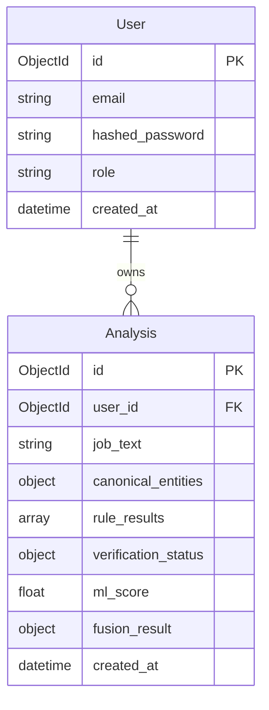

# RecruitSafe — Database Architecture & Schemas

---

## 📖 Table of Contents

1. [Intended Audience](#-intended-audience)
2. [Database Strategy & Technologies](#-database-strategy--technologies)
3. [Entity-Relationship Diagram](#-entity-relationship-diagram)
4. [User Collection (`User`)](#-user-collection-user)
5. [Analysis Collection (`Analysis`)](#-analysis-collection-analysis)
6. [Indexing & Query Optimization](#-indexing--query-optimization)
7. [TTL (Time-To-Live) Policies](#-ttl-time-to-live-policies)
8. [Performance & Scalability Plans](#-performance--scalability-plans)
9. [📚 Documentation Navigation](#-documentation-navigation)

---

## 🎯 Intended Audience

This document is designed for **database administrators (DBAs)**, **backend developers**, and **security officers** wanting to understand RecruitSafe storage collections, schemas, indexes, and performance designs.

---

## 🗄️ Database Strategy & Technologies

RecruitSafe uses **MongoDB** as its primary persistence layer. To interface with MongoDB from the FastAPI backend, the application utilizes **Beanie ODM** (Object Document Mapper) coupled with the async **Motor** driver. This choice ensures non-blocking, asynchronous database operations, aligning with the asynchronous architecture of the backend.

---

## 📐 Entity-Relationship Diagram

RecruitSafe maintains a structured relational link between its two main collections:

---

## 👤 User Collection (`User`)

Stores user credentials and platform role configurations.

* **Class Mapper**: `app.models.user.User`
* **Collection Name**: `users`

### Schema Definition

| Field Name | Data Type | Description | Constraints |
|------------|-----------|-------------|-------------|
| `_id` | `ObjectId` | Auto-generated MongoDB identifier. | Primary Key |
| `email` | `string` | User email address used for login. | Unique Index |
| `hashed_password` | `string` | Securely hashed password string (bcrypt). | Mandatory |
| `role` | `string` | Access control role (`user` or `admin`). | Default: `user` |
| `created_at` | `datetime` | Timestamp of registration. | Auto-generated |

---

## 🔍 Analysis Collection (`Analysis`)

Stores the raw text inputs and all associated threat extraction, verification status, and decision fusion scores.

* **Class Mapper**: `app.models.analysis.Analysis`
* **Collection Name**: `analyses`

### Schema Definition

| Field Name | Data Type | Description | Constraints |
|------------|-----------|-------------|-------------|
| `_id` | `ObjectId` | Auto-generated analysis identifier. | Primary Key |
| `user_id` | `ObjectId` | Reference link to the creator user ID. | Foreign Key |
| `job_text` | `string` | Raw text of the analyzed job listing. | Mandatory |
| `canonical_entities` | `dict` | Normalized metadata parameters (31 fields). | Optional |
| `rule_results` | `list` | Triggered detection rules with matched text. | Mandatory |
| `verification_status` | `dict` | Active domain SSL, WHOIS, and DNS states. | Mandatory |
| `ml_score` | `float` | Scanned probability from XGBoost model. | Mandatory |
| `fusion_result` | `dict` | Composite score, verdict, and confidence metrics. | Mandatory |
| `created_at` | `datetime` | Date when the scan was executed. | Mandatory |

---

## ⚡ Indexing & Query Optimization

To maintain sub-millisecond query performance in high-traffic environments, RecruitSafe configures the following database indexes:

1. **`users` Collection**:
   - **Unique Index** on `email`: Speeds up authentication checks and prevents duplicate signups.
2. **`analyses` Collection**:
   - **Compound Index** on `{user_id: 1, created_at: -1}`: Optimizes query resolution for dashboard logs and user scan history list pages.
   - **Index** on `created_at`: Speeds up cleanup routines and analytical telemetry.

---

## ⏳ TTL (Time-To-Live) Policies

There are currently no automatic TTL deletion policies configured on the main `analyses` collection to preserve user scan logs. In a future production release, standard data retention policies will be applied to automatically archive raw parsed job text files older than 180 days to minimize storage footprint.

---

## 📈 Performance & Scalability Plans

* **Read Optimization**: Use query projection (`.project()`) inside Beanie ODM calls when rendering list indexes to fetch only titles and verdicts, leaving large raw job texts out of memory.
* **Write Optimization**: Execute database logs asynchronously in background threads via FastAPI background tasks, keeping API response latency low.

---

## 📚 Documentation Navigation

| Document | Target Audience | Key Contents |
|----------|-----------------|--------------|
| [Root README](../README.md) | Everyone | Project pitch, technology stack, previews, and quick start. |
| [Setup Guide](Setup.md) | Developers, DevOps | Local configuration, dependencies, and environment files. |
| [System Architecture](Architecture.md) | Technical Architects | Layered model, pipeline orchestrator, data flow. |
| [API Specifications](API.md) | Frontend Engineers | Complete route details, payload schemas, and response maps. |
| [Developer Guide](DeveloperGuide.md) | Software Engineers | Pipeline extensions, adding custom rules, and testing guidelines. |
| [User Guide](UserGuide.md) | Job Seekers, Recruiters | Interpreting threat indicators and downloading PDF reports. |
| [Configuration Reference](Configuration.md) | DevOps, System Operators | Behavior parameter configurations and score maps. |
| [Security Architecture](Security.md) | Security Auditors | Threat models, JWT encryption, and sanitization parameters. |
| [Testing Guide](Testing.md) | QA Engineers, Developers | pytest tests, validation boundary targets, and unit tests. |
| [Deployment Guide](Deployment.md) | DevOps, SREs | Production setups, Docker orchestration, and reverse proxies. |
| [Future Roadmap](Roadmap.md) | Product Managers, Visitors | Planned release timeline and architectural expansions. |
