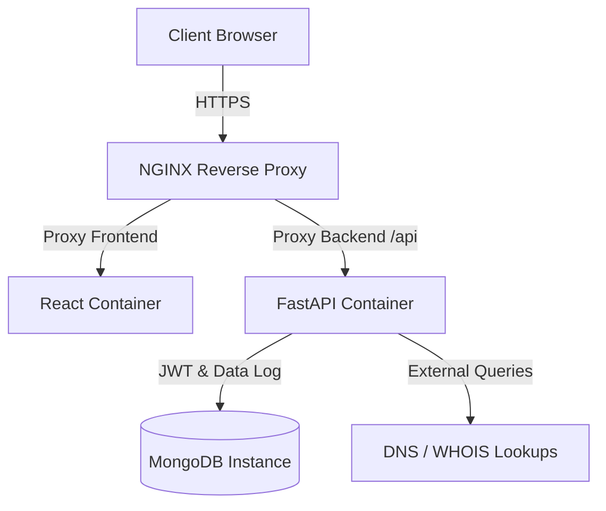

# RecruitSafe — Deployment & Operations Guide

---

## 📖 Table of Contents

1. [Intended Audience](#-intended-audience)
2. [Deployment Topology](#-deployment-topology)
3. [Containerized Deployment via Docker](#-containerized-deployment-via-docker)
4. [Environment Variables Reference](#-environment-variables-reference)
5. [Reverse Proxy Configuration (NGINX)](#-reverse-proxy-configuration-nginx)
6. [Data Backup & Migration](#-data-backup--migration)
7. [Scaling & High Availability](#-scaling--high-availability)
8. [📚 Documentation Navigation](#-documentation-navigation)

---

## 🎯 Intended Audience

This document is designed for **DevOps engineers**, **system administrators**, and **reliability engineers** who deploy RecruitSafe into production or staging environments.

---

## 📐 Deployment Topology

In a standard production environment, RecruitSafe runs as a set of containerized services connected to a secure database:



---

## 🐳 Containerized Deployment via Docker

### 1. Backend Dockerfile
The backend uses a multi-stage build to compile spaCy and load the required models. Below is the configuration structure:
```dockerfile
FROM python:3.13-slim

WORKDIR /app

RUN apt-get update && apt-get install -y gcc build-essential && rm -rf /var/lib/apt/lists/*

COPY requirements.txt .
RUN pip install --no-cache-dir -r requirements.txt
RUN python -m spacy download en_core_web_sm

COPY . .

CMD ["uvicorn", "app.main:app", "--host", "0.0.0.0", "--port", "8000"]
```

### 2. Docker Compose Orchestration
You can spin up the entire application stack using the following `docker-compose.yml` template:
```yaml
version: '3.8'

services:
  database:
    image: mongo:8.0
    container_name: recruitsafe_db
    ports:
      - "27017:27017"
    volumes:
      - mongo_data:/data/db

  backend:
    build: ./backend
    container_name: recruitsafe_backend
    ports:
      - "8000:8000"
    environment:
      - MONGODB_URL=mongodb://database:27017/recruitsafe
      - SECRET_KEY=your_production_secret_key
      - GROQ_API_KEY=your_groq_api_key
    depends_on:
      - database

  frontend:
    build: ./frontend
    container_name: recruitsafe_frontend
    ports:
      - "80:80"
    depends_on:
      - backend
```

---

## ⚙️ Environment Variables Reference

Ensure all credentials, API tokens, database URIs, and JWT secret keys are passed securely using container environment variables or secrets. Do not hardcode values in Dockerfiles or configuration files.

---

## 🚏 Reverse Proxy Configuration (NGINX)

Configure NGINX to handle HTTPS/TLS termination and route requests to the frontend and backend containers:

```nginx
server {
    listen 443 ssl;
    server_name recruitsafe.example.com;

    ssl_certificate /etc/letsencrypt/live/recruitsafe.example.com/fullchain.pem;
    ssl_certificate_key /etc/letsencrypt/live/recruitsafe.example.com/privkey.pem;

    location / {
        proxy_pass http://frontend:80;
        proxy_set_header Host $host;
    }

    location /api {
        proxy_pass http://backend:8000;
        proxy_set_header Host $host;
        proxy_set_header X-Real-IP $remote_addr;
    }
}
```

---

## 💾 Data Backup & Migration

* **Database Backups**: Execute automated daily database backups using MongoDB `mongodump` utility:
  ```bash
  docker exec -t recruitsafe_db mongodump --out /data/db/backups/
  ```
* **Beanie ODM Migrations**: Database schemas are managed automatically by Beanie on application boot. Schema alterations should be verified on staging before production deployment.

---

## 📈 Scaling & High Availability

* **FastAPI Backend**: Run multiple backend container instances behind your NGINX load balancer to handle concurrent request spikes.
* **MongoDB**: Deploy a MongoDB replica set configuration in production to ensure database failover protection.

---

## 📚 Documentation Navigation

| Document | Target Audience | Key Contents |
|----------|-----------------|--------------|
| [Root README](../README.md) | Everyone | Project pitch, technology stack, previews, and quick start. |
| [Setup Guide](Setup.md) | Developers, DevOps | Local configuration, dependencies, and environment files. |
| [System Architecture](Architecture.md) | Technical Architects | Layered model, pipeline orchestrator, data flow. |
| [API Specifications](API.md) | Frontend Engineers | Complete route details, payload schemas, and response maps. |
| [Developer Guide](DeveloperGuide.md) | Software Engineers | Pipeline extensions, adding custom rules, and testing guidelines. |
| [User Guide](UserGuide.md) | Job Seekers, Recruiters | Interpreting threat indicators and downloading PDF reports. |
| [Database Schema](Database.md) | DBAs, Backend Devs | Collection definitions, indexes, and Beanie ODM setup. |
| [Configuration Reference](Configuration.md) | DevOps, System Operators | Behavior parameter configurations and score maps. |
| [Security Architecture](Security.md) | Security Auditors | Threat models, JWT encryption, and sanitization parameters. |
| [Testing Guide](Testing.md) | QA Engineers, Developers | pytest tests, validation boundary targets, and unit tests. |
| [Future Roadmap](Roadmap.md) | Product Managers, Visitors | Planned release timeline and architectural expansions. |
