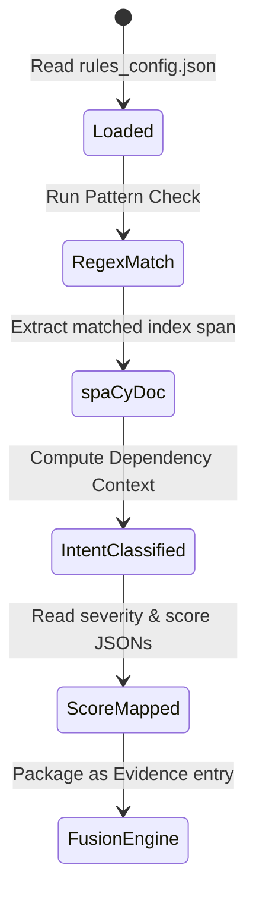

# RecruitSafe — Developer Customization Guide

---

## 📖 Table of Contents

1. [Intended Audience](#-intended-audience)
2. [Codebase Architecture & Layout](#-codebase-architecture--layout)
3. [Adding a Custom Rule](#-adding-a-custom-rule)
4. [Custom Rule Lifecycle](#-custom-rule-lifecycle)
5. [Adding Verification Modules](#-adding-verification-modules)
6. [Updating/Replacing the ML Model](#-updatingreplacing-the-ml-model)
7. [Fusing Score Adjustments](#-fusing-score-adjustments)
8. [Debugging & Logging Specifications](#-debugging--logging-specifications)
9. [Performance Considerations](#-performance-considerations)
10. [📚 Documentation Navigation](#-documentation-navigation)

---

## 🎯 Intended Audience

This document is designed for **software developers**, **NLP engineers**, and **contributors** who want to customize and extend the threat scoring logic, regex lists, active verifications, or machine learning models.

---

## 📂 Codebase Architecture & Layout

RecruitSafe organizes modules by feature boundaries:

* **`backend/app/services/nlp/`**: Singleton spaCy pipeline initializer (`nlp_service.py`), intent classifier matching (`intent_classifier.py`), and Pydantic validation schemas (`models.py`).
* **`backend/app/services/rules/`**: Registry loader and execution scheduler (`pipeline.py`), and standard regex rules (`builtin_rules.py`).
* **`backend/app/services/ai/`**: ML classifier helper (`ml_service.py`) loading vectorizers and XGBoost models.
* **`backend/app/services/fusion/`**: Score aggregator combining verification, rule, and ML values (`fusion_engine.py`).
* **`backend/app/config/`**: JSON configuration directory governing rule keywords, intent severities, score points, and fusion weights.

---

## 🔌 Adding a Custom Rule

### Step 1: Register in `rules_config.json`
Append your rule description block to `backend/app/config/rules_config.json`:
```json
{
  "id": "advance_payment",
  "name": "Upfront Payment Request",
  "description": "Triggered when a post demands upfront money for processing or onboarding.",
  "category": "financial_fraud",
  "severity": "high",
  "weight_key": "payment_request",
  "default_weight": -40,
  "keywords": [
    "\\b(pay|deposit|advance|transfer)\\s+(\\d+|money|fee|funds)\\s+(for|to)\\s+processing\\b"
  ]
}
```

### Step 2: Register in `builtin_rules.py`
Open `backend/app/services/rules/builtin_rules.py` and register the rule ID under the context-aware list to trigger token validation:
```python
context_aware_rules = {
    "payment", "registration_fee", "training_fee", "paid_certification",
    "telegram_only", "whatsapp_only", "telegram", "whatsapp",
    "no_interview", "guaranteed_placement", "urgency_urg", "advance_payment"
}
```

### Step 3: Extend the Intent Classifier
In `backend/app/services/nlp/intent_classifier.py`, add custom classification heuristics to map matches to intents:
```python
if "processing" in sentence or "fee" in sentence:
    return "MANDATORY_PAYMENT"
```

---

## 📐 Custom Rule Lifecycle

The state transition flow for a single rule evaluated within the processing pipeline:



---

## 🌐 Adding Verification Modules

Live domain infrastructure footprint lookups are located in `backend/app/services/website_verifier.py`. 

To write a custom verification routine:
1. Define a helper method inside `WebsiteVerifier` (e.g. checking recruiter telephone registry records).
2. Ensure network requests utilize `httpx` async clients with strict timeouts:
   ```python
   async with httpx.AsyncClient(timeout=5.0) as client:
       response = await client.get(target_url)
   ```
3. Update `PipelineOrchestrator` to execute the checker and inject the result into `verification_status`.

---

## 🤖 Updating/Replacing the ML Model

The machine learning classifier runs asynchronously on backend load:
1. Train a new TF-IDF vectorizer and export it as `backend/app/services/ai/recruitsafe_vectorizer.pkl`.
2. Train your XGBoost model and export it to `backend/app/services/ai/recruitsafe_xgb.pkl`.
3. Update version metrics inside `backend/app/services/ai/metadata.json`:
   ```json
   {
     "model_name": "recruitsafe_xgb",
     "model_version": "2.0.0",
     "dataset_version": "2.5.0",
     "algorithm": "XGBoost",
     "trained_at": "2026-07-25"
   }
   ```
4. Query the `/api/ml/health` endpoint to verify model health.

---

## 🎛️ Fusing Score Adjustments

You can tweak the engine's final decision weights without modifying any source code:
1. Open `backend/app/config/fusion_config.json`.
2. Edit the weight values. The total sum must equal `1.0`:
   ```json
   {
     "rules_weight": 0.40,
     "verification_weight": 0.35,
     "ml_weight": 0.25
   }
   ```
3. Save the file. Changes are hot-reloaded on subsequent incoming requests.

---

## 📝 Debugging & Logging Specifications

* **Logging Instance**: Access the shared logger by importing:
  ```python
  import logging
  logger = logging.getLogger("recruitsafe")
  ```
* **Verbosity Level**: Backend defaults to `INFO` logs detailing startup processes, ODM statuses, model preloads, and pipeline metrics.
* **Troubleshooting Pipelines**: To debug rule outputs, run the python testing script:
  ```bash
  python -m pytest backend/tests/test_nlp.py -vv
  ```

---

## ⚡ Performance Considerations

* **NLP preloading**: Always pass the spacy Doc instance sequentially through rules rather than re-tokenizing. Re-running spaCy tokenizers in loops will severely degrade request speed.
* **Database Queries**: Create indexes for any new document query lookups.
* **Third-Party API calls**: Set strict connection timeouts.

---

## 📚 Documentation Navigation

| Document | Target Audience | Key Contents |
|----------|-----------------|--------------|
| [Root README](../README.md) | Everyone | Project pitch, technology stack, previews, and quick start. |
| [Setup Guide](Setup.md) | Developers, DevOps | Local configuration, dependencies, and environment files. |
| [System Architecture](Architecture.md) | Technical Architects | Layered model, pipeline orchestrator, data flow. |
| [API Specifications](API.md) | Frontend Engineers | Complete route details, payload schemas, and response maps. |
| [User Guide](UserGuide.md) | Job Seekers, Recruiters | Interpreting threat indicators and downloading PDF reports. |
| [Database Schema](Database.md) | DBAs, Backend Devs | Collection definitions, indexes, and Beanie ODM setup. |
| [Configuration Reference](Configuration.md) | DevOps, System Operators | Behavior parameter configurations and score maps. |
| [Security Architecture](Security.md) | Security Auditors | Threat models, JWT encryption, and sanitization parameters. |
| [Testing Guide](Testing.md) | QA Engineers, Developers | pytest tests, validation boundary targets, and unit tests. |
| [Deployment Guide](Deployment.md) | DevOps, SREs | Production setups, Docker orchestration, and reverse proxies. |
| [Future Roadmap](Roadmap.md) | Product Managers, Visitors | Planned release timeline and architectural expansions. |
