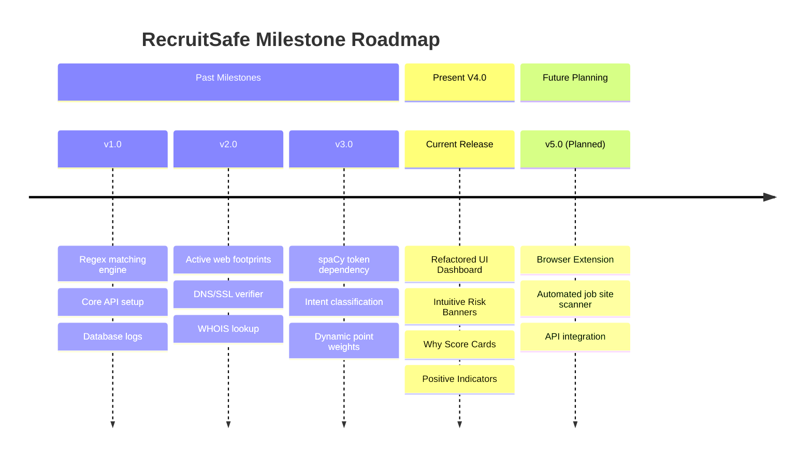

# RecruitSafe — Feature Roadmap & Vision

---

## 📖 Table of Contents

1. [Intended Audience](#-intended-audience)
2. [Product Vision](#-product-vision)
3. [Release Timeline Chart](#-release-timeline-chart)
4. [Version Release History](#-version-release-history)
5. [Completed Milestones](#-completed-milestones)
6. [Planned Extensions (Next Releases)](#-planned-extensions-next-releases)
7. [Long-Term Architectural Vision](#-long-term-architectural-vision)
8. [📚 Documentation Navigation](#-documentation-navigation)

---

## 🎯 Intended Audience

This document is designed for **product managers**, **visitors**, **contributors**, and **recruiters** who want to track the feature evolution and future objectives of RecruitSafe.

---

## 👁️ Product Vision

RecruitSafe aims to be a leading open-source job scanning platform. Our vision is to empower candidates with transparent, explainable threat assessments when applying to online job offers.

---

## 📐 Release Timeline Chart

Below is the release timeline and architecture progression:

---

## 📜 Version Release History

* **V1 (Base Engine)**: Core regular expression engine, basic FastAPI REST endpoints, and MongoDB integration.
* **V2 (Active Verification)**: Introduced live domain, DNS, SSL, and WHOIS query pipelines.
* **V3 (Context Analysis)**: Integrated spaCy token dependency models and dynamic intent-based scoring weights.
* **V4 (Commercial UI & Explainability)**: Refactored dashboard metrics, risk scoring cards, and positive indicator sections.

---

## ✅ Completed Milestones

* Decoupled regex matching patterns into configurable JSON databases.
* Completed spaCy single-loaded NLP service to process syntax trees efficiently.
* Completed dynamic scoring calculations based on semantic intent mapping.
* Refactored frontend dashboards to translate percentages into clear risk assessments.
* Created a complete validation framework testing NLP accuracy and boundary limits.

---

## 🚀 Planned Extensions (Next Releases)

### Browser Companion Extension (V5.0)
* **Goal**: Build a browser extension (Chrome, Firefox) that parses job details from sites like LinkedIn, Indeed, and glassdoor on hover, showing the Trust Score inline.

### Threat Intelligence Registry
* **Goal**: Enable shared database storage of verified scam templates and toxic recruiter email domain registries across platform nodes.

---

## 🔮 Long-Term Architectural Vision

* **Incremental Model Learning**: Set up pipeline workers that retrain the XGBoost text classifier on user-reported scam listings.
* **Multilingual support**: Expand the NLP engine beyond English to check multi-language descriptions (e.g. Spanish, German, French).

---

## 📚 Documentation Navigation

| Document | Target Audience | Key Contents |
|----------|-----------------|--------------|
| [Root README](../README.md) | Everyone | Project pitch, technology stack, previews, and quick start. |
| [Setup Guide](Setup.md) | Developers, DevOps | Local configuration, dependencies, and environment files. |
| [System Architecture](Architecture.md) | Technical Architects | Layered model, pipeline orchestrator, data flow. |
| [API Specifications](API.md) | Frontend Engineers | Complete route details, payload schemas, and response maps. |
| [Developer Guide](DeveloperGuide.md) | Software Engineers | Pipeline extensions, adding custom rules, and testing guidelines. |
| [User Guide](UserGuide.md) | Job Seekers, Recruiters | Interpreting threat indicators and downloading PDF reports. |
| [Database Schema](Database.md) | DBAs, Backend Devs | Collection definitions, indexes, and Beanie ODM setup. |
| [Configuration Reference](Configuration.md) | DevOps, System Operators | Behavior parameter configurations and score maps. |
| [Security Architecture](Security.md) | Security Auditors | Threat models, JWT encryption, and sanitization parameters. |
| [Testing Guide](Testing.md) | QA Engineers, Developers | pytest tests, validation boundary targets, and unit tests. |
| [Deployment Guide](Deployment.md) | DevOps, SREs | Production setups, Docker orchestration, and reverse proxies. |
