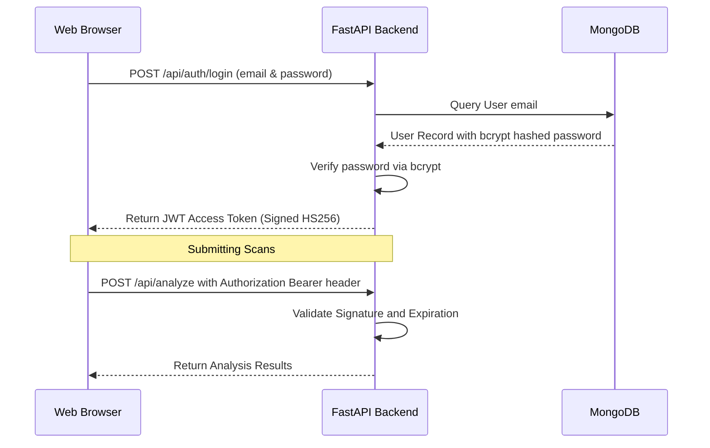

# RecruitSafe — Security Architecture & Threat Model

---

## 📖 Table of Contents

1. [Intended Audience](#-intended-audience)
2. [JWT Authentication Lifecycle](#-jwt-authentication-lifecycle)
3. [Core Security Controls](#-core-security-controls)
4. [Input Sanitization Policies](#-input-sanitization-policies)
5. [CORS & Network Policies](#-cors--network-policies)
6. [Threat Modeling & Mitigation Map](#-threat-modeling--mitigation-map)
7. [Security Assumptions & Constraints](#-security-assumptions--constraints)
8. [📚 Documentation Navigation](#-documentation-navigation)

---

## 🎯 Intended Audience

This document is designed for **security auditors**, **penetration testers**, and **backend developers** who verify the platform's security boundaries, cryptographic controls, and input sanitization policies.

---

## 📐 JWT Authentication Lifecycle

RecruitSafe uses stateless JSON Web Token (JWT) credentials to secure access to analytical endpoints:

---

## 🔒 Core Security Controls

* **Password Hashing**: Stored passwords are encrypted using **bcrypt** with a secure work factor (salt rounds), protecting credentials from raw database leaks.
* **Stateless Session Tokens**: User sessions are validated using signed JWT access tokens with a default expiration duration of 60 minutes.
* **CORS Management**: Backend limits requests to verified client origin lists configured in `.env`.

---

## 🧼 Input Sanitization Policies

To mitigate Cross-Site Scripting (XSS) and code injection threats, RecruitSafe enforces a strict input sanitization pipeline on all submitted job descriptions:
* **Bleach Sanitizer**: The backend imports `bleach` to parse and strip any raw HTML tags, javascript payloads, or script parameters before saving data or parsing text.
* **Beanie ODM Mapping**: Prevent NoSQL injections by enforcing strong typing on all database calls via Pydantic model schemas.

---

## 🛡️ Threat Modeling & Mitigation Map

RecruitSafe addresses common cybersecurity threats using the following mitigations:

| Attack Vector | Threat Description | RecruitSafe Mitigation |
|---------------|--------------------|------------------------|
| **XSS Injection** | Attacker inserts malicious `<script>` tags inside job descriptions. | `bleach` parses and sanitizes text inputs. |
| **Brute Force** | Dictionary attack attempts on user login endpoints. | Implement rate limiting middlewares on authentication routes. |
| **NoSQL Injection** | Attacker crafts MongoDB query parameter strings. | Pydantic and Beanie ODM isolate data fields. |
| **Data Leakage** | Eavesdropping on JSON payloads over network transits. | Enforce HTTPS/TLS connection boundaries in production. |

---

## ⚠️ Security Assumptions & Constraints

* **Host Machine Integrity**: We assume the hosting operating system and MongoDB server environment are secure.
* **Credential Safety**: User passwords must meet standard entropy limits to resist basic dictionary attacks.
* **HTTPS Requirement**: JWT authorization tokens travel inside request headers; they must be encrypted in transit using standard HTTPS protocol.

---

## 📚 Documentation Navigation

| Document | Target Audience | Key Contents |
|----------|-----------------|--------------|
| [Root README](../README.md) | Everyone | Project pitch, technology stack, previews, and quick start. |
| [Setup Guide](Setup.md) | Developers, DevOps | Local configuration, dependencies, and environment files. |
| [System Architecture](Architecture.md) | Technical Architects | Layered model, pipeline orchestrator, data flow. |
| [API Specifications](API.md) | Frontend Engineers | Complete route details, payload schemas, and response maps. |
| [Developer Guide](DeveloperGuide.md) | Software Engineers | Pipeline extensions, adding custom rules, and testing guidelines. |
| [User Guide](UserGuide.md) | Job Seekers, Recruiters | Interpreting threat indicators and downloading PDF reports. |
| [Database Schema](Database.md) | DBAs, Backend Devs | Collection definitions, indexes, and Beanie ODM setup. |
| [Configuration Reference](Configuration.md) | DevOps, System Operators | Behavior parameter configurations and score maps. |
| [Testing Guide](Testing.md) | QA Engineers, Developers | pytest tests, validation boundary targets, and unit tests. |
| [Deployment Guide](Deployment.md) | DevOps, SREs | Production setups, Docker orchestration, and reverse proxies. |
| [Future Roadmap](Roadmap.md) | Product Managers, Visitors | Planned release timeline and architectural expansions. |
