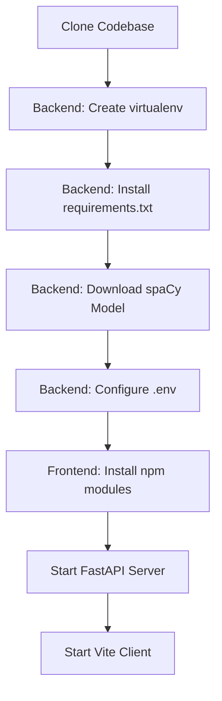

# RecruitSafe — Installation & Setup Guide

---

## 📖 Table of Contents

1. [Intended Audience](#-intended-audience)
2. [Prerequisites](#-prerequisites)
3. [Setup Flowchart](#-setup-flowchart)
4. [Step-by-Step Installation](#-step-by-step-installation)
5. [Environment Variables Reference](#-environment-variables-reference)
6. [Running the Application](#-running-the-application)
7. [Running Verification Tests](#-running-verification-tests)
8. [Troubleshooting Guide](#-troubleshooting-guide)
9. [📚 Documentation Navigation](#-documentation-navigation)

---

## 🎯 Intended Audience

This document is designed for **developers**, **DevOps engineers**, and **QA engineers** setting up RecruitSafe in a local environment for development and testing.

---

## 📋 Prerequisites

Before starting, ensure you have the following runtimes and databases installed locally:
* **Python**: Version `3.10` or above (`3.13` recommended).
* **Node.js**: Version `18` or above (`20` recommended).
* **MongoDB**: A running local MongoDB Community Edition server, or an active connection string to a MongoDB Atlas cluster.

---

## 📐 Setup Flowchart

Below is the step-by-step configuration flow for a clean local installation:



---

## 🛠️ Step-by-Step Installation

### 1. Clone the Codebase
Clone the project repository and navigate into the root directory:
```bash
git clone https://github.com/tanyajha29/RecruitSafe.git
cd RecruitSafe
```

### 2. Backend Installation & Dependency Setup
Navigate to the `backend/` directory, set up your Python virtual environment, and install dependencies:
```bash
cd backend
python -m venv venv

# Activate Virtual Environment
# On Windows (PowerShell):
.\venv\Scripts\Activate.ps1
# On Linux/macOS:
source venv/bin/activate

# Install requirements
pip install -r requirements.txt
```

Download the required spaCy English NLP model pipeline:
```bash
python -m spacy download en_core_web_sm
```

### 3. Frontend Installation & NPM Setup
Open a new terminal session, navigate to the `frontend/` directory, and install dependencies:
```bash
cd frontend
npm install
```

---

## ⚙️ Environment Variables Reference

Create a file named `.env` in the `backend/` directory. Use the following key-value pairs:

| Variable Name | Default / Example Value | Description |
|---------------|-------------------------|-------------|
| `MONGODB_URL` | `mongodb://localhost:27017/recruitsafe` | Local or cloud MongoDB instance URI. |
| `SECRET_KEY` | `your_secret_jwt_key_here` | Secret key used for signing JWT login tokens. |
| `ALGORITHM` | `HS256` | Encryption algorithm used for session authorization. |
| `ACCESS_TOKEN_EXPIRE_MINUTES` | `60` | Token expiration time. |
| `GROQ_API_KEY` | `gsk_your_groq_api_key` | API Key for Groq Cloud semantic analysis summaries. |
| `GROQ_MODEL` | `llama-3.3-70b-versatile` | LLM used for final summary text generation. |

> [!WARNING]
> Keep the `.env` file out of git source control. It is ignored by default in the root `.gitignore`.

---

## 🚀 Running the Application

### 1. Booting the FastAPI Backend Server
From the `backend/` folder (with the virtual environment activated), start the server using Uvicorn:
```bash
python -m uvicorn app.main:app --host 127.0.0.1 --port 8000 --reload
```
* **API Documentation Swagger UI**: [http://127.0.0.1:8000/docs](http://127.0.0.1:8000/docs)

### 2. Running the Vite Frontend Client
From the `frontend/` directory, start the React development server:
```bash
npm run dev
```
* **Client App URL**: [http://localhost:5173](http://localhost:5173)

---

## 🧪 Running Verification Tests

Validate that your local setup is fully functional by executing the test suites from the `backend/` directory:

### Run Unit Tests
```bash
python -m pytest
```

### Run Context-Aware Rule Verification Framework
```bash
python -m tests.run_validation_framework
```

---

## 🔍 Troubleshooting Guide

* **Issue**: *spaCy model not found errors on pipeline startup.*
  - **Fix**: Run `python -m spacy download en_core_web_sm` again. Ensure it is installed under the active virtual environment context.
* **Issue**: *Cannot connect to database on startup.*
  - **Fix**: Ensure your local MongoDB community server is running on port `27017`. Run `mongod` in your terminal to check.
* **Issue**: *React network connection error.*
  - **Fix**: Check if the backend is running at `http://127.0.0.1:8000`. The frontend communicates with it via pre-configured API routing proxies.

---

## 📚 Documentation Navigation

| Document | Target Audience | Key Contents |
|----------|-----------------|--------------|
| [Root README](../README.md) | Everyone | Project pitch, technology stack, previews, and quick start. |
| [System Architecture](Architecture.md) | Technical Architects | Layered model, pipeline orchestrator, data flow. |
| [API Specifications](API.md) | Frontend Engineers | Complete route details, payload schemas, and response maps. |
| [Developer Guide](DeveloperGuide.md) | Software Engineers | Pipeline extensions, adding custom rules, and testing guidelines. |
| [User Guide](UserGuide.md) | Job Seekers, Recruiters | Interpreting threat indicators and downloading PDF reports. |
| [Database Schema](Database.md) | DBAs, Backend Devs | Collection definitions, indexes, and Beanie ODM setup. |
| [Configuration Reference](Configuration.md) | DevOps, System Operators | Behavior parameter configurations and score maps. |
| [Security Architecture](Security.md) | Security Auditors | Threat models, JWT encryption, and sanitization parameters. |
| [Testing Guide](Testing.md) | QA Engineers, Developers | pytest tests, validation boundary targets, and unit tests. |
| [Deployment Guide](Deployment.md) | DevOps, SREs | Production setups, Docker orchestration, and reverse proxies. |
| [Future Roadmap](Roadmap.md) | Product Managers, Visitors | Planned release timeline and architectural expansions. |
