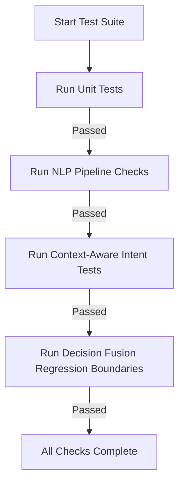

# RecruitSafe — Verification & Testing Suite Guide

---

## 📖 Table of Contents

1. [Intended Audience](#-intended-audience)
2. [Testing Strategy Overview](#-testing-strategy-overview)
3. [Test Runner Execution Flow](#-test-runner-execution-flow)
4. [Unit Tests Layout](#-unit-tests-layout)
5. [Pipeline Validation Framework](#-pipeline-validation-framework)
6. [Machine Learning Validation](#-machine-learning-validation)
7. [Regression Boundary Testing](#-regression-boundary-testing)
8. [Running Test Suites locally](#-running-test-suites-locally)
9. [📚 Documentation Navigation](#-documentation-navigation)

---

## 🎯 Intended Audience

This document is designed for **QA engineers**, **developers**, and **open-source contributors** who write, execute, or inspect automated tests for RecruitSafe.

---

## 📋 Testing Strategy Overview

RecruitSafe uses a multi-layered testing strategy to guarantee that business logic, context extraction, ML inference accuracy, and Decision Fusion remain correct over modifications:

* **Unit Testing**: Isolated checks verifying single modules (e.g. token extraction, user creation, rule matches).
* **NLP Pipeline Validation**: Verifies that spaCy syntax parsing, lemmatization, and token dependencies map correctly to intents.
* **Regression Boundary Testing**: Asserts that scoring changes do not cause regression anomalies.

---

## 📐 Test Runner Execution Flow

The test suite runs through various diagnostic stages:



---

## 📂 Unit Tests Layout

Tests are written using the **pytest** framework.

* **Path**: `backend/tests/`

Key test scripts:
* **`test_nlp.py`**: Asserts that `NLPService` initializes as a shared singleton and segments sentences correctly.
* **`test_context_analyzer.py`**: Verifies that the Configurable Context Window correctly extracts left and right token boundaries.
* **`test_intent_classifier.py`**: Verifies that custom sentences map to the expected semantic intent labels.
* **`test_rules.py`**: Asserts that keyword regex pattern matches identify mock scam sentences.

---

## 🚂 Pipeline Validation Framework

The platform includes a dedicated validation pipeline script (`tests/run_validation_framework.py`) that checks the entire analysis pipeline without relying on external networks or databases. It validates:
* Regex parsing correctness.
* spaCy token parsing completeness.
* Dependency relation extractions.
* Correct intent mapping and score deductions.

---

## 🤖 Machine Learning Validation

A custom script is provided to validate ML model vectors and booster weights:
* **Path**: `backend/tests/test_ml.py`
* **Checks**:
  - Asserts the XGBoost booster can process vectorized floats correctly.
  - Verifies that model predictions return expected bounds `[0.0, 1.0]`.

---

## ⚠️ Regression Boundary Testing

To prevent scoring regressions, the test suite includes job descriptions representing verified safe, suspicious, and scam profiles. The tests evaluate the final fused composite risk verdict against historical baseline expectations to ensure updates do not cause scoring regressions.

---

## 🚀 Running Test Suites Locally

### 1. Execute pytest Unit Tests
Navigate to the `backend/` directory, activate your virtual environment, and run:
```bash
python -m pytest
```

### 2. Execute NLP Pipeline Validation
From the `backend/` directory, run:
```bash
python -m tests.run_validation_framework
```

---

## 📚 Documentation Navigation

| Document | Target Audience | Key Contents |
|----------|-----------------|--------------|
| [Root README](../README.md) | Everyone | Project pitch, technology stack, previews, and quick start. |
| [Setup Guide](Setup.md) | Developers, DevOps | Local configuration, dependencies, and environment files. |
| [System Architecture](Architecture.md) | Technical Architects | Layered model, pipeline orchestrator, data flow. |
| [API Specifications](API.md) | Frontend Engineers | Complete route details, payload schemas, and response maps. |
| [Developer Guide](DeveloperGuide.md) | Software Engineers | Pipeline extensions, adding custom rules, and testing guidelines. |
| [User Guide](UserGuide.md) | Job Seekers, Recruiters | Interpreting threat indicators and downloading PDF reports. |
| [Database Schema](Database.md) | DBAs, Backend Devs | Collection definitions, indexes, and Beanie ODM setup. |
| [Configuration Reference](Configuration.md) | DevOps, System Operators | Behavior parameter configurations and score maps. |
| [Security Architecture](Security.md) | Security Auditors | Threat models, JWT encryption, and sanitization parameters. |
| [Deployment Guide](Deployment.md) | DevOps, SREs | Production setups, Docker orchestration, and reverse proxies. |
| [Future Roadmap](Roadmap.md) | Product Managers, Visitors | Planned release timeline and architectural expansions. |
