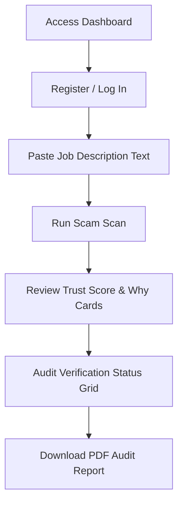

# RecruitSafe — User Guide & Application Manual

---

## 📖 Table of Contents

1. [Intended Audience](#-intended-audience)
2. [User Workflow Overview](#-user-workflow-overview)
3. [Account Setup & Authentication](#-account-setup--authentication)
4. [Submitting a Job Posting for Scan](#-submitting-a-job-posting-for-scan)
5. [Interpreting Trust Scores & Safety Metrics](#-interpreting-trust-scores--safety-metrics)
6. [Understanding Positives vs. Risk Indicators](#-understanding-positives-vs-risk-indicators)
7. [Downloading PDF Reports](#-downloading-pdf-reports)
8. [Managing Scan History & Statistics](#-managing-scan-history--statistics)
9. [📚 Documentation Navigation](#-documentation-navigation)

---

## 🎯 Intended Audience

This document is designed for **job seekers**, **recruiters**, and **security auditors** looking for a non-technical walkthrough of how to register, scan listings, analyze trust indicators, and download reports.

---

## 📐 User Workflow Overview

Below is the general path a user takes when verifying a new job posting inside RecruitSafe:

---

## 🔐 Account Setup & Authentication

1. **Accessing the App**: Navigate to [http://localhost:5173/](http://localhost:5173/).
2. **Register**: Click on **Register**, enter your email, choose a secure password, and click **Create Account**.
3. **Login**: Enter your credentials on the **Login** page. Upon successful authentication, your browser will cache the secure JWT token, granting access to the main dashboard.

---

## 🔍 Submitting a Job Posting for Scan

1. From the dashboard sidebar, select **New Analysis**.
2. Paste the full text of the job description, hiring email, or outreach message into the main text box.
3. Click **Scan Posting**.
4. The system executes the analysis pipeline in the background and redirects you to the results view.

*(Screenshot Placeholder: scan_job_view.png — Displays the job pasting textarea input box and scan execution button)*

---

## 📊 Interpreting Trust Scores & Safety Metrics

### Safety Verdict Banner
* **Verification Complete: Low Risk** (🟢 Success): Indicates standard corporate hiring structures. Proceed with normal precautions.
* **Potential Recruitment Risk Detected** (🟡 Warning): Discrepancies found in domain registrations or email validation. Manual checking is advised.
* **Potential Recruitment Risk Detected** (🔴 Danger): Severe indicators of fraud detected (e.g. mandatory payments or restricted chat channels). Do not share personal details.

### Trust Score Card
* Shows the calculated opportunity legitimacy score out of `100%`.
* **Why? Section**: Displays the top three negative factors affecting the score (e.g., training fees requested or unverified email domains).
* **How is it calculated? Drawer**: Click the link in the card to view a description of how the Rule Engine, Infrastructure Verification, and Machine Learning models are fused together.

### Analysis Confidence Card
* Displays how confident the system is in its verdict based on the completeness of available data.
* **Higher confidence** means the job posting contained verified recruiter email domains or accessible company website links.

---

## 🛡️ Understanding Positives vs. Risk Indicators

Results are split to provide a clear balanced view of the posting:
* **Positive Indicators**: Displays verified trust markers such as `HTTPS enabled`, `Valid SSL certificate`, and `Corporate email verified`.
* **Risk Indicators**: Highlights anomalies such as `Upfront payment request detected` or `Communication restricted to chat apps`.

---

## 📄 Downloading PDF Reports

1. On the results page, click **Download Report**.
2. RecruitSafe compiles a comprehensive, print-friendly PDF report summarizing:
   - Final verdict metrics
   - Opportunity legitimacy meter
   - Canonical extraction statistics
   - Component fusion weights and breakdown

*(Screenshot Placeholder: download_pdf_view.png — Shows the PDF download buttons and report naming format)*

---

## 📈 Managing Scan History & Statistics

* **History Page**: Accessible via the sidebar. List page showing all your historical job scans, verdicts, and trust scores. Use search bars to filter records.
* **Dashboard Stats**: Displays aggregate stats of all processed items (total count, Safe vs. High-Risk breakdowns, and recent threat warnings).

---

## 📚 Documentation Navigation

| Document | Target Audience | Key Contents |
|----------|-----------------|--------------|
| [Root README](../README.md) | Everyone | Project pitch, technology stack, previews, and quick start. |
| [Setup Guide](Setup.md) | Developers, DevOps | Local configuration, dependencies, and environment files. |
| [System Architecture](Architecture.md) | Technical Architects | Layered model, pipeline orchestrator, data flow. |
| [API Specifications](API.md) | Frontend Engineers | Complete route details, payload schemas, and response maps. |
| [Developer Guide](DeveloperGuide.md) | Software Engineers | Pipeline extensions, adding custom rules, and testing guidelines. |
| [Database Schema](Database.md) | DBAs, Backend Devs | Collection definitions, indexes, and Beanie ODM setup. |
| [Configuration Reference](Configuration.md) | DevOps, System Operators | Behavior parameter configurations and score maps. |
| [Security Architecture](Security.md) | Security Auditors | Threat models, JWT encryption, and sanitization parameters. |
| [Testing Guide](Testing.md) | QA Engineers, Developers | pytest tests, validation boundary targets, and unit tests. |
| [Deployment Guide](Deployment.md) | DevOps, SREs | Production setups, Docker orchestration, and reverse proxies. |
| [Future Roadmap](Roadmap.md) | Product Managers, Visitors | Planned release timeline and architectural expansions. |
